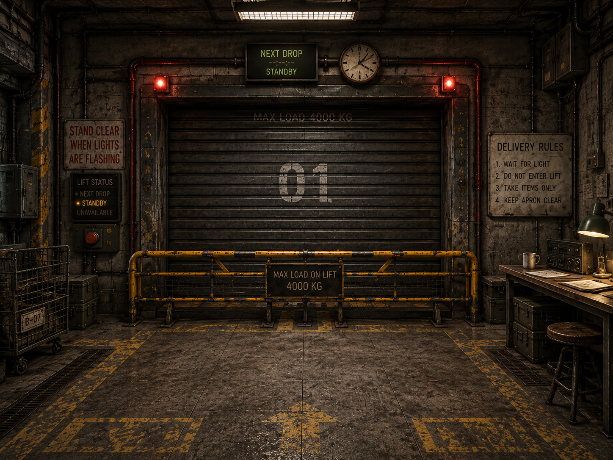
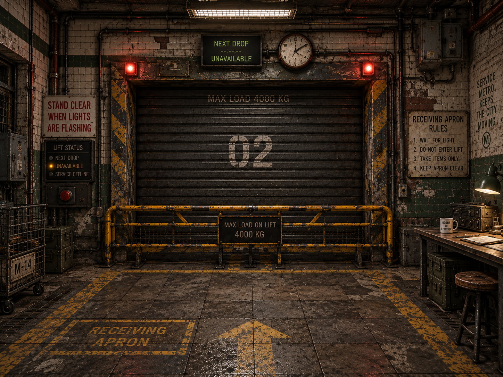
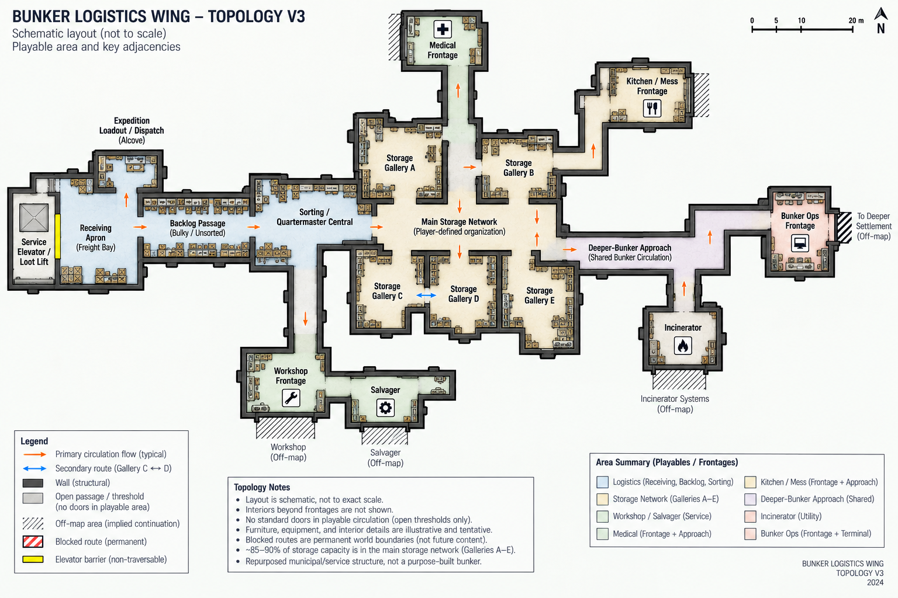
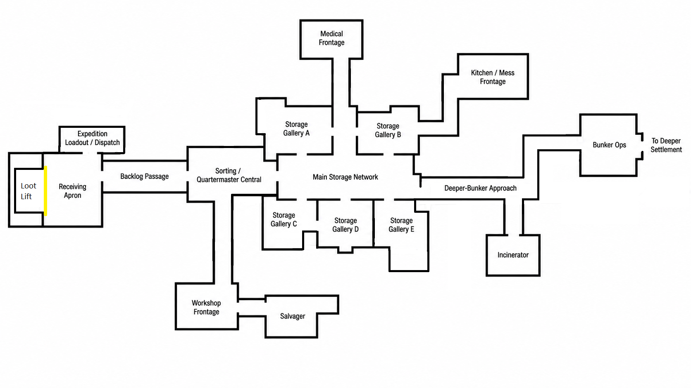
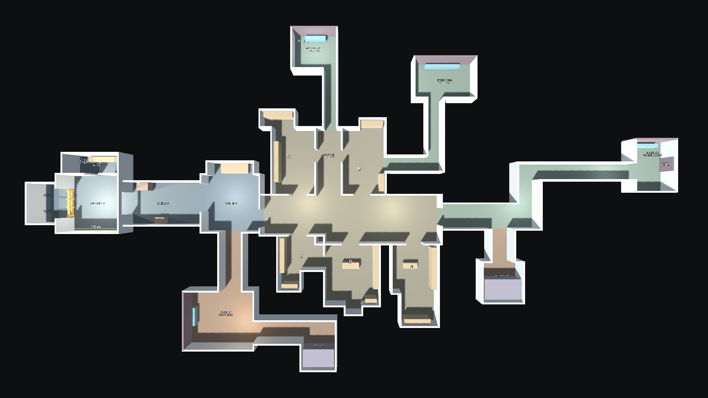

# Sorting Apocalypse Visual Design Direction v0.6

> Generated text/table extract of the same-named DOCX. Content order is retained; Word pagination, headers and text styling are not reproduced. Embedded images are linked below. Edit the master and regenerate; this is not an independently authored authority.

SORTING APOCALYPSE

VISUAL DESIGN & WORLD-BUILDING DIRECTION

Unfinished / decommissioned underground service-level bunker

|  |  |
| --- | --- |

Receiving mood references - useful for layering, warmth, material contrast and functional composition. Wear/grime is an upper bound, not the production target.

Version 0.6 | 20 September 2026

Design basis: GDD v0.9; Prototype Findings v0.9; accepted in-engine wing geometry; continuing gameplay and palette acceptance; ground-access shelf and ceiling experiment; bounded fixed-ladder proof decision.

| CORE VISUAL PROMISE The bunker should look like a real underground municipal/service structure that has been occupied, adapted, repaired, and organized for years - not like a purpose-built survival base. The player should be able to read what the structure used to be, what later builders changed, what survivors adapted, and what the Quartermaster has made orderly. |
| --- |

## 1. Purpose, authority, and status

Version 0.6 retains the established world, material and service-space grammar and the human-promoted in-engine wing geometry. It adds current storage-installation ergonomics, authoring responsibility and the bounded fixed-ladder proof. Production art, final gallery furnishing, camera and ceiling promotion, and functional modular racks remain separate work.

It does not replace the GDD, Prototype Findings, or feature/system specifications. Gameplay, interaction, storage, Receiving, progression, and technical constraints remain authoritative. This document translates those constraints into architecture, materials, lighting, environmental storytelling, spatial composition, and art-production guidance.

Section 29 retains the original V3/V2 schematics unchanged as design-history and relationship references. The accepted in-engine layout and later explicit decisions take precedence over their pixels and superseded labels. Section 31 records the final overview; it is a real greybox capture, not a new concept image or production-art approval.

| Status | Meaning | Use in this document |
| --- | --- | --- |
| CONFIRMED | Design baseline | Locked world-building/art-direction rules and production constraints. |
| DIRECTION | Preferred solution | Current spatial or visual recommendation to validate in-game. |
| OPEN / TBD | Unresolved | Exact interaction object, progression timing, balance, labels, dimensions, or topology still requires design/playtesting. |

## 2. Core world premise and identity

| METRO-ORIGIN TEST The facility's transit ancestry should be archaeological, not iconic. An average player should read “old underground service / municipal infrastructure,” not “subway platform.” A civil or rail worker may recognize the deeper ancestry. |
| --- |

### 2.1 What the bunker was

The survivors occupy part of an unfinished or decommissioned metro-service / maintenance-level construction project. The playable area is not a passenger station and does not expose passenger or rail infrastructure. There are no tracks, platforms, ticketing systems, commuter wayfinding, or long train-tunnel spaces dominating the play area. Collapsed or unfinished tunnel heads may imply civil-engineering continuation without making the player feel that they are standing on a subway platform.

### 2.2 Construction chronology

The visible pre-apocalypse construction spans roughly 30-50 years of mostly late-20th-century civil/service work, interrupted by halted construction, partial resumptions, repairs, and later upgrades. The site was mixed-status before the apocalypse: some completed service areas still received occasional maintenance or utility access, while unfinished expansions and abandoned branches had already been neglected.

- No World War II bunker visual language.

- No futuristic or sci-fi construction language.

- Changes in materials or methods should usually occur at believable construction-phase, repair, or functional boundaries.

### 2.3 Survivor occupation

The settlement has been established for several years. Survivors have had time to organize, patch, label, furnish, ventilate, and operationalize the space, but not to comprehensively renovate it. Major structural work by the survivor community is uncommon. Their skill is expressed through competent adaptation of limited and mismatched resources.

| IMPROVISED DOES NOT MEAN SLOPPY. Survivor work can be mismatched, ugly, or clearly salvaged while still being structurally sound, logically routed, firmly mounted, and professionally competent. |
| --- |

### 2.4 The apocalypse is context, not decor

The bunker remains a safe haven. The game deliberately shelters the Quartermaster from the surface threat; the player knows the broader zombie-apocalypse premise, but the playable environment does not constantly advertise it. Scarcity, expeditions, repairs, requests, blocked infrastructure, and salvaged objects imply the world state. Routine gore, zombie warnings, combat fortifications, traps, or militarized interior checkpoints would pull focus away from the logistics fantasy.

| REMOVE THE MARKETING CONTEXT TEST Without knowing the zombie premise, the bunker should still read as a resource-constrained underground community keeping an old facility operational. Knowing the premise should make the same details acquire deeper meaning. |
| --- |

## 3. Historical and visual layers

| Layer | Visual meaning |
| --- | --- |
| Layer A - Original civil/service infrastructure | Concrete, masonry, selective tile/paint, drainage, utility systems, structural bays, old safety/service markings. |
| Layer B - Interrupted construction and later upgrades | Unfinished openings, capped services, material transitions, newer electrical/mechanical additions, repairs, partial commissioning. |
| Layer C - Survivor adaptation | Furniture, patched services, ventilation, shutters, barriers, scavenged equipment, competent improvised installations. |
| Layer D - Quartermaster order | Labels, work zones, storage decisions, clear lanes, paperwork, staging, shelf logic, accumulated logistics habits. |

The layers should remain visually distinguishable. A later layer sits on top of the older structure; it should not erase the evidence that the older layer existed.

## 4. Governing art-direction principles

### 4.1 Readability before spectacle

Environment art supports fast recognition, item retrieval, storage planning, route memory, and interaction. Atmosphere must not obscure shelves, hatches, carried items, request interfaces, or floor circulation.

### 4.2 Low-detail realism, not photorealism

Use strong silhouettes, convincing construction logic, restrained materials, decals, repeated modules, and a limited number of landmark structures. Concept images are composition/mood references, not a fidelity target.

### 4.3 Efficiency is an aesthetic

Clear routes, shallow readable shelves, sensible staging, work zones, and repeatable infrastructure make the Quartermaster fantasy satisfying. Disorder exists, but the environment itself should reward organization.

### 4.4 One bunker, distinct operational districts

The underlying shell remains architecturally continuous. Departmental service spaces also have distinct footprint and approach characters, not the same rectangle repeated with different props. Later lighting, equipment, maintenance, signage and services reinforce identities already supported by the greybox.

### 4.5 Rational architecture, historically caused irregularity

The original facility makes engineering sense. Irregularity comes from halted construction, later upgrades, collapses, awkward annexes, repairs, service penetrations, and years of occupation - not arbitrary level-design geometry.

### 4.6 Structurally trustworthy core

Occupied areas feel worn but dependable. Serious collapse, heavy water damage, or visibly unsafe structure belongs mainly at abandoned edges and blocked continuations.

## 5. Universal material and surface grammar

| THE BUNKER ENVELOPE IS PRIMARILY MINERAL, NOT METALLIC. Concrete, cement/render, masonry, blockwork, and occasional brick form the building. Metal belongs mainly to reinforcement, shutters, barriers, gratings, pipes, vents, trays, rails, plates, and later infrastructure. |
| --- |

### 5.1 Layered surface hierarchy

1. Structural substrate - poured concrete, cement/render, block/masonry, occasional brick, exposed structural slabs/beams/columns.

2. Applied finish - old paint, localized tile, faded institutional bands, patch render/cement, survivor plywood/wood repairs.

3. Utility/service systems - pipes, conduit, vents, cable trays, electrical boxes, shutters, barriers, gratings and rails.

4. Survivor occupation - furniture, shelving, lamps, electronics, containers, workstations and practical additions.

5. Character/detail - wear, grime, localized rust, scuffs, mineral staining, decals, notes, signage and repair marks.

| Every new visual layer should look applied to an older one, not as though the whole room was rebuilt in that style. |
| --- |

### 5.2 Wall families

- Concrete-dominant: rough cast, patched, painted, drilled/anchored, with limited damp or repair staining.

- Localized aged glazed tile or institutional service finish where function/construction phase supports it.

- Painted blockwork or masonry in cheaper/later utility areas.

- Survivor plywood, timber, mesh, or corrugated sheet used mainly as patching, infill, partitions, shutters, or retrofit - not as the primary shell.

### 5.3 Floors

Poured concrete is the dominant circulation surface, but a single obvious repeating concrete tile must be avoided. Variation should come from different pours, subtle aggregate/color changes, expansion joints, repairs, traffic wear, drainage, trench covers, short grating sections, steel plates, old safety paint, and survivor operational markings. Large quiet areas remain valuable.

### 5.4 Paint

Most visible architectural paint belongs to the pre-apocalypse facility: faded institutional green/blue/cream, old safety yellow, bay markings, door surrounds, utility identifiers, and partial color bands. Survivor-applied paint is sparse, newer, rougher, and functional: keep-clear boundaries, hazard edges, storage marks, arrows, or quick labels. Whole-room survivor repainting for aesthetics is out of character.

## 6. Wear, cleanliness, moisture, and irregularity

| Wear is causal, not a uniform “grunge pass.” Active spaces are worn, irregular, and imperfect, but visibly maintained enough to support daily work. |
| --- |

| Cause / location | Expected visual evidence |
| --- | --- |
| High-use contact | Scuffed routes, worn edges, polished/dirty touch points, chipped corners, tape residue, furniture rub. |
| Environmental exposure | Localized mineral staining, rust around fasteners/pipes/drains, grime at wall bases and penetrations. |
| Neglected edges | Heavier dust, corrosion, debris, failed fixtures, older water marks, abandoned construction residue. |
| Maintained work zones | Usable work surfaces, clear walking paths, repaired or isolated serious damage, less accumulated dirt. |

Moisture is localized evidence of being underground, not the bunker’s dominant atmosphere. Active areas are generally dry and habitable. Seepage, puddling, mineral trails, damp corners, and heavier corrosion concentrate around drains, old joints, damaged sections, or abandoned branches.

| IRREGULARITY TEST The player should be able to imagine why neighboring things do not match. The explanation need not be stated, but one should plausibly exist. |
| --- |

## 7. Lighting and color

| Functional coverage without fixture uniformity. The bunker is lit by accumulated working solutions, not by a designer who specified one fixture schedule for the entire building. |
| --- |

Warm-to-neutral light should dominate ordinary occupied areas. Cooler fluorescent/service fixtures remain part of the mix but should not define the bunker. Replacements do not have to match older fixtures. Task lights, wall lamps, commercial fixtures, and survivor replacements can coexist. Harsh uniform industrial light should be limited because it is tiring, visually unforgiving, and pushes the world toward lab/military/warehouse language.

- Receiving: warm/neutral general light plus industrial task and warning accents.

- Sorting: comfortable work lighting with good monitor/surface readability and warmer local task sources.

- Storage: calm, legible shelf illumination; avoid deep item-obscuring shadows.

- Medical Supply Anteroom: somewhat brighter/neutral, but never overexposed clinical white.

- Workshop/service leg: more directional industrial sources, still avoiding blanket harshness.

- Unused/dead branches: reduced coverage, spill light, failed/absent fixtures, but not horror-game blackness.

Architecture stays mostly neutral: concrete grey, dirty off-white/cream, faded green/blue, dark steel, oxidized metal, plywood/wood, and safety yellow. Strong color belongs to functional accents, warning lights, facility identity, loot, and restrained Quartermaster labeling.

## 8. Signage, labels, humor, and human traces

| Generation | Character |
| --- | --- |
| Legacy facility signage | Sparse. Utility IDs, hazards, load limits, construction/maintenance marks, partial bay numbers. The project was never fully finished, so polished wayfinding is limited. |
| Survivor operational signage | Hand-painted/printed instructions, warnings, return procedures, scavenged signs reused pragmatically or humorously. |
| Quartermaster organization | Most systematic and readable layer: restrained labels, tags, category cues, staging instructions and storage references. Exact player-labeling mechanics remain TBD. |

Humor should be dry, situational, and human rather than zany or meme-heavy. A scavenged road sign, passive-aggressive maintenance note, absurd old prohibition sign, or sarcastic label can work because it feels like something residents chose to keep. Do not turn every wall into a punchline.

### 8.1 Workplace first, domestic traces second

The logistics floor is a workplace that has gradually become the Quartermaster’s de facto living space. Appropriate traces include a small sink, mug, plates/cutlery, thermos, coat, pens, notebooks, a comfortable chair, a hardy plant, or a few personal notes. There is no dedicated bedroom, lounge, or recreation corner in the playable logistics wing. Personal objects should usually have a practical reason to be where they are.

## 9. Authored-world and unseen-community rules

| The playable environment is authored and spatially persistent. Decorative storytelling objects do not autonomously move, appear, disappear, or get cleaned up to simulate unseen NPC activity. |
| --- |

Physical changes occur only through explicit player-legal actions or designed system transitions. Unseen residents are communicated through requests, audio, hatches, lights, deliveries, machinery state, one-way messages, and static environmental evidence - not ambient prop simulation.

The bunker leader is referred to as the Administrator. The Administrator and other residents remain physically off-screen. One-way operational messages may carry tutorials, upgrade confirmations, exposition, warnings, and personality; the Quartermaster does not need branching dialogue or visible NPC conversations.

## 10. Universal environment-production protocol: the Foundation Gate

| Every major space must independently pass Layer 1 - Structural Shell and Layer 2 - Applied Finish before infrastructure, furniture, dressing, or final lighting is allowed to carry the composition. |
| --- |

### 10.1 Layer 1 - Structural Shell

- Dimensions and proportions; floor/ceiling levels; walls and major openings.

- Recesses, alcoves, columns, beams, circulation, sightlines, and relationship to implied off-map spaces.

- Architecture must make sense before attractive equipment, clutter, or lighting is added.

- Human visual approval required during prototype environment development.

| Layer 1 review question: Does this feel like a plausible part of the underground facility before we add anything interesting to it? |
| --- |

### 10.2 Layer 2 - Applied Finish

- Concrete/masonry and floor material families.

- Localized paint/tile/render/patch logic and construction-phase transitions.

- Baseline wear, repair, dirt, and surface variation.

- Review under reasonably neutral lighting before relying on atmosphere.

- Human visual approval required before later passes.

| Lighting may enhance a good material composition, but it must not be used to hide a bad one. |
| --- |

### 10.3 Later layers

1. Layer 3 - Services / infrastructure: pipes, vents, conduit, machinery, barriers, shutters, functional lighting.

2. Layer 4 - Survivor occupation: furniture, workstations, storage, practical additions.

3. Layer 5 - Character/detail: signage, notes, small props, humor, localized grime and storytelling.

The Foundation Gate remains a production-art checkpoint. The completed seeded-storage integration scene used real functional shelves and loot in neutral geometry before finished materials; a bounded functional Receiving prototype may follow the current §32.5 sequence. Neither promotes the art layers or authorizes dressing a failed composition. No general furnishing or departmental delivery design is required for Receiving. [D17B]

## 11. Spatial and architectural grammar

- Human-scale service spaces: Most areas are larger than domestic rooms but remain contained and practical. Receiving, junctions, and machinery bays can be selectively larger; dead ends may tighten.

- Mixed exposed services: Original infrastructure is partly concealed and partly exposed. Survivor additions are often surface-mounted. Not every wall or ceiling needs pipes, vents, or cables.

- Exposed structural ceilings: Concrete slabs/beams remain visible; services and fixtures accumulate selectively below them. Uniform dropped ceilings are rare.

- Visible modularity: Structural bays, wall joints, floor joints, columns, ceiling spans and service standards may repeat. Repairs, later phases, local function and survivor adaptation selectively disrupt the rhythm. Initial greybox geometry should favor a small number of purposeful orthogonal offsets, bends, and width changes; small incidental wall niches/alcoves can be added later case by case once the main structure is proven.

- Controlled access without militarization: Heavy doors, locks, shutters and barriers appear only where function requires them. Normal playable circulation defaults to open thresholds/doorways without routine operable doors, preserving flow and sightlines. Fixed closures are reserved for off-map boundaries, blocked continuations, freight machinery, and similarly justified hard limits.

## 12. Core logistics relationship: Receiving → Sorting → Storage

The accepted working spine is Receiving -> Backlog Passage -> Sorting / Quartermaster Central -> Main Storage Network -> Deeper-Bunker Approach. Its thresholds, proportions and offsets have passed human greybox review. Preserve this in-engine layout unless a specific later interaction or furnished-clearance test justifies a change; the sequence is not a mandate for a straight corridor. [A17]

### 12.1 Backlog transition

The passage between Receiving and Sorting may be intentionally widened to carry static “I’ll get to that tomorrow” environmental backlog: tarped pallets, stacked car tires, a broken chair over boxes, a washing machine, obsolete equipment, or other bulky non-loot objects. These props should be clearly distinct from catalogue loot through scale, form, wrapping/tarping, lack of gameplay Utility/category fit, or obvious furniture/machinery identity. A comfortable walking lane remains clear.

| Receiving = incoming uncertainty. Backlog passage = unresolved leftovers. Sorting = temporary deliberate staging. Storage = resolved organization. |
| --- |

## 13. Receiving Apron / Freight Bay

Receiving is a former freight/service loading point adapted into a goods-transfer interface. It is somewhat rougher and more overtly industrial than Sorting/Storage, but the permanent concrete/masonry structure remains visually dominant. The service elevator itself is the only spatial implication of the surface/outside-world conduit: there is no playable lateral surface-access route, signage, or explanatory corridor beside the lift.

- Architecture first: adapt freight equipment to the existing accepted aperture and surrounding wall, not the room to a prefab doorway. Dispatch is the accepted shallow external annex beside Receiving with its own doorless opening; keep its usable volume distinct from the apron. It is not a new destination corridor.

- Wide and shallow: Construct a distinct rectangular freight enclosure behind an aperture in the Receiving west wall. Solid room-wall sections flank the opening; the cage has its own inset rear wall, side walls, floor and ceiling. The rear of the cage is not the apron's surrounding wall. A permanent barrier keeps the shallow bay inaccessible; no route around the cage is implied. [H16]

- Barrier: A strong example of competent survivor improvisation. It may combine repurposed industrial parts, but must look firmly anchored and intentional.

- Shutter: Heavy, simple, mechanically understandable, battered but functional. Corrugated/segmented metal belongs here because it is equipment, not the shell.

- Floor: Concrete with repair patches, drainage/trench/grate interruptions, faded hazard/keep-clear markings and cart/freight wear.

- Services: Moderate and localized around freight machinery, one service wall, or ceiling edge. Leave significant concrete surfaces visually quiet.

- Wear: Usage wear more than neglect; the inaccessible freight recess can be somewhat rougher.

- Signage: Load limits, bay ID, emergency stop, concise receiving rules, sparse Quartermaster notes, occasional scavenged humor.

### 13.1 Sorting sightline

The accepted desk/aperture relationship provides a partial lift view with interrupted full-core and Storage-to-Ops vistas. Round three restored Backlog/Sorting proportions and adjusted the northern opening edge with explicit approval. Preserve the geometry and real work stance rather than reopening the earlier frozen-edge constraint. Actual pile-item identification, lining occlusion and physical reach remain Receiving tests. [A17]

## 14. Sorting / Quartermaster Central

| Sorting is not a destination room. It is a widened logistics passage that the Quartermaster appropriated because it sits directly on the Receiving → Storage route. |
| --- |

- Sorting table: Wall-fitted, wide and fairly shallow, clear flat gameplay surface. Accessible from its west, south, and east edges; approximately 0.5 m clearance is a useful schematic minimum, but exact clearance is a greybox variable. No chair and no decorative loot-like clutter on the usable surface.

- Monitor/clock: Wall-mounted or ceiling-hung rather than consuming the sorting surface. Ordinary commercial/office equipment, not command-center hardware.

- Spatial relationship: retain the accepted desk stance and turns toward Receiving and Storage. Partial aperture visibility is spatially approved; identifying and fully unloading actual items is not yet tested. Furniture changes must preserve the useful relationship or trigger a focused review.

- Personality: A small sink and personal/practical effects may sit to one side of the sorting table, with a small auxiliary desk/work surface, filing cabinet, or equivalent to the other. If those elements would force the passage to grow into a room, move some of them to the opposite wall rather than enlarging Quartermaster Central.

- Infrastructure: Restrained; the scene is already information-dense. Quiet wall/ceiling surfaces are valuable.

- Starting state: Functional but imperfect, reflecting an experienced Quartermaster with established routines and a backlog of “tomorrow” tasks.

## 15. Storage galleries and alcoves

| Storage is an adapted architectural condition, not a purpose-built stockroom. The Quartermaster fits capacity into inherited underground geometry and works around pillars, beams, wall jogs, ceiling constraints, and circulation compromises. |
| --- |

The main Storage network should contain roughly 85-90% of total storage capacity across five partially enclosed but visually connected galleries/alcoves, A-E. The remaining 10-15% can appear as opportunistic satellite storage elsewhere in the bunker: a small former technical room converted to secure lockers, a squat shelf under a beam, a clothes rail along a useful wall, or other architecturally constrained units.

- Circulation: One bent/variable-width primary storage spine plus one deliberate short secondary connection between Gallery C and Gallery D. This creates one useful loop without becoming a ring, grid, or maze. Gallery E remains primarily single-entry and is not a shortcut into the Deeper-Bunker Approach.

- Partial enclosure: Existing walls, columns, offsets, broad doorless openings and restrained orthogonal wall jogs create distinct pockets while keeping adjacent areas perceptible. Irregularity should be purposeful and buildable; avoid puzzle-like outlines or decorative micro-alcoves in the initial shell.

- Access vs capacity: preserve the single C-D secondary link and the accepted A-east/B-west openings to shared Main Storage circulation. Medical is reached from that connector without entering A; Kitchen is reached through B-east. Retain no direct Medical-Kitchen shortcut and no E-to-Deeper bypass. These accepted relationships supersede conflicting early schematic/prose rules. [A17]

- Shelf placement: Predominantly perimeter/wall fitted, but gameplay usability governs. Wall shelves should be shallower; deeper units belong where the player can walk around them.

- Freestanding units: Generally low-to-medium height to preserve sightlines. Taller islands are exceptions proven through first-person testing.

- Shelf height: Ordinary ground-access storage must preserve reliable visibility, targeting and retrieval from supported standing approaches without a ladder. Intentionally ladder-served storage may exceed that limit only after the bounded fixed-ladder proof. Ceiling irregularities, flush beams and low structural elements can justify specialist or deliberately lower installations; they do not justify uniformly compressing every shelf family.

- Furniture language: Coherent backbone of a few repeated general-purpose families, supplemented by scavenged cupboards, lockers, crates, low units and specialist storage.

- Player agency: Main galleries have soft spatial affordances but no predetermined category identity. Gallery A is convenient/near Sorting; B is farther along the inhabited side; C is relatively long or mildly dog-legged; D is the central irregular gallery with the C connection; E is the constrained far-side pocket near the deeper-bunker transition. These shapes aid spatial memory without prescribing taxonomy; the player supplies the categories.

### 15.1 Storage upgrades and sockets

Storage capacity is spatially authored. Every shelf, locker, rack, cabinet, or other storage unit occupies a predetermined socket. Progression can install/activate units at those sockets; there is no free-form shelf placement. If movement is later allowed, it should be constrained to specific unit/socket relationships rather than arbitrary building.

Future sockets are mostly implicit. Some are empty; others may contain authored placeholder clutter such as obsolete equipment, broken furniture, tarped material, or construction leftovers. Upgrades occur during the nightly transition, allowing the placeholder clutter to be removed and the new unit installed without visible pop-in or animation. The player should not see glowing upgrade pads or painted “future shelf” markers.

The starting amount of installed physical capacity is moderate. The quantity of pre-seeded loot at new game remains an economy/balance TBD and is intentionally not specified by this visual document.

## 16. Dedicated service spaces and inner facility boundaries

| VISIBLE SUPPORT SPACE, UNSEEN STAFFED CORE. Workshop / Kitchen service rooms and the Medical Supply Anteroom are playable; Bunker Ops is an open Transfer Landing. Opaque inner boundaries exclude only the staffed operation, not the support-space footprint. |
| --- |

CONFIRMED Workshop and Kitchen have dedicated player-accessible service rooms; Medical has a Supply Anteroom. Bunker Ops uses a more open, dedicated Transfer Landing. These are supporting departmental spaces that plausibly need no continuously visible worker, not staffed workplaces emptied of people. Their functions include material handoff, equipment support and limited staging, rather than overflow storage alone. [D16S]

The staffed fabrication floor, treatment ward, cooking/mess interior and administrative office remain unseen behind opaque inner boundaries. A service room may be a genuine room that the Quartermaster enters. Do not replace it with a corridor hatch, a row of consoles, or a solid off-map block occupying its playable footprint. Furnishing and delivery choreography are later milestones, not prerequisites for the current geometry revision.

### 16.1 Three separate boundaries

| Boundary | Player-facing meaning | Greybox obligation |
| --- | --- | --- |
| Territorial | The player enters department-owned support space. | Open traversable entrance / defined landing edge; room identity cannot depend on a door blocking entry. |
| Material ownership | Supplies transfer only through an explicit legal submission action. | Reserve a plain labelled interface envelope at the inner boundary. No interactions or automatic room-entry consumption in this milestone. |
| Playable world | The staffed operation stays outside the playable domain. | Continuous opaque inner wall / fixed closure behind usable room floor. No accessible operational core or exposed empty room beyond it. |

### 16.2 Distinct footprints; bounded implementation scope

Workshop remains a broad room-like support space; Kitchen an elongated catering-service room; Medical an anteroom widening west of its aligned corridor wall; Bunker Ops an open dedicated transfer landing. Their accepted footprints and approaches distinguish the destinations. Use the saved geometry as the working dimensional baseline, not the original schematic pixels. [A17]

The neutral geometry provides enclosing floors/ceilings, wall thickness, open territorial entrances, inner boundaries and essential proxy masses. The completed continuing-gameplay integration uses only the functional fixtures needed to test handling. Departmental furnishing, hatch mechanics, delivery choreography and final audio/lighting remain later work; no speculative asset acquisition or four bespoke interaction systems are required. [D16S, D17B]

Department ownership is not a new inventory rule. These spaces add no implicit free Quartermaster capacity, retrievable departmental reserve, automatic submission or autonomous prop handling. Existing utility lanes, request consequences, Workshop projects and output rules are retained.

## 17. Workshop Service Room / service leg + Salvager

Workshop occupies an infrastructure-heavy service branch from Sorting/early Storage, not through Gallery C. The accepted room is a broad playable equipment/project-material support space with a distinct opaque inner boundary to the unseen staffed Workshop. Retain the separate Salvager path and ordinary continuous southern wall; no abandoned continuation or reserved opening remains. Furniture and final staff-door/interface placement are later decisions. [A17, D16-R02]

- Footprint and arrival: Preserve the branch's restrained bend and a clear open entrance into the wider service room. One purposeful orthogonal offset may shape equipment support and circulation; do not invert intended solid wall mass into an accidental nook. Reserve usable standing/turning floor at the future intake.

- Later occupation: Department-owned non-loot equipment and staging can occupy the room's edges. Existing asset families are considered sufficient by the developer; exact selection and furnishing are deferred. Do not fill the main approach corridor to manufacture Workshop identity.

- Workmanship: Competent installations using mismatched/scavenged resources. Avoid Mad Max / junk-tech aesthetics.

- Services: Densest active-area service exposure: electrical feeds, extraction, conduit, sockets, junctions, ventilation, compressed-air-like lines, but still clustered with quiet concrete surfaces retained.

- Lighting: More industrial/directional than Storage, still avoiding blanket harshness.

- Audio / staffed-core limit: Later localized service sound can imply work beyond the inner wall. Do not expose an empty staffed production setting or add visible workers, ongoing NPC simulation or a new handling chore. Exact cues remain later scope.

### 17.1 Salvager

Retain the accepted bent/oblique Salvager spur, front-operated machine envelope and current approach reveal. These are spatial baseline decisions, not proof of functional machinery or final assets. The former adjacent abandoned continuation has been removed completely; no replacement is reserved in the Workshop district. [A17, D16-R02]

## 18. Medical Supply Anteroom

| Medical has protected usable support space. Clear floor is intentional; the player enters the Supply Anteroom but never the treatment ward. |
| --- |

Medical is reached without crossing a gallery: the full A/B connector belongs to Main Storage, followed by a 10 m Medical-exclusive protected corridor. The anteroom keeps its 7.8 x 7.0 m nominal size, lies north of that corridor and widens westward; its eastern wall continues the corridor wall and entry is at the south-east. This accepted arrangement keeps the shared circulation, departmental buffer and opaque staffed-core boundary distinct. No direct Medical-Kitchen route is introduced. [A17]

- Protected territory: The approach and anteroom are not Quartermaster storage-expansion or backlog sockets. Preserve clear floor as intentional departmental support space, even before later equipment is selected. Crossing the outer room threshold does not submit supplies.

- Finish: Better maintained, not newer: painted concrete, limited old tile, repaired chips, restrained stains, comparatively clean floor/wall bases.

- Lighting: Somewhat brighter/neutral but not clinical; fixture mismatch remains acceptable.

- Infrastructure: Low exposed-service density, neatly routed conduit/ventilation, little heavy machinery.

- Later equipment / scope: Restrained non-loot supply and equipment support may establish Medical identity. No visible ward, beds, patients, empty reception desk or theatrical quarantine sequence is required. Exact furnishing and submission mechanism are deferred.

- Signage: Clear but restrained Medical identity; avoid giant red-cross theming.

## 19. Kitchen Service Room / unseen Kitchen and Mess

The player enters a dedicated catering-support service room, not cooking stations or a mess hall with its occupants removed. The unseen operation remains led by a competent chef and supported by staff; its social and working life is implied beyond the inner wall. The accessible room supports meal supplies and the existing ration-related functions without adding a new cooking or service chore. [D16S]

- Spatial position: The approach leaves Gallery B through its eastern doorway under the developer's round-one correction. This explicitly replaces the former no-gallery-mediated Kitchen route. Preserve the modest separation from Medical and dirty machinery; no direct Medical↔Kitchen connection is added. [H16]

- Footprint: retain the accepted elongated service-room floor, east-then-north approach and usable arrival. The staffed kitchen/mess boundary is the inner wall, not the entrance. Exact furnishings and interface placements remain open; do not change the accepted room dimensions without new gameplay evidence. [A17]

- Finish: Used and repeatedly cleaned: painted concrete, partial tile, repaired floor, scrubbed wear, localized grease/water staining without domestic grime.

- Lighting: Warmest inhabited service space; later warm spill plus practical neutral coverage. Human warmth without café/home-kitchen styling; greybox review remains neutral.

- Services: Later extraction, plumbing and electrical concentration belong near the inner facility boundary. They must not be needed to explain where the playable service floor ends.

- Later equipment: Department-owned catering/service equipment can reinforce identity without resembling accessible Food/Hydration loot. Prop roster and placement remain deferred; do not interpret decorative equipment as edible reserve, free Quartermaster storage or usable ration output.

- Community cues: Later restrained audio, practical notices and equipment relationships imply the occupied kitchen/mess beyond the wall. Static background objects remain authored; no unseen-tray-collection simulation or routine prop rearrangement is introduced.

- Humor: Chef-authored supply notes or vague menu humor can target circumstances, not incompetence.

## 20. Deeper-Bunker Approach and Bunker Ops Transfer Landing

| Bunker Ops sits at a believable terminus of the playable logistics wing, where the architecture strongly implies that the settlement continues beyond the player’s accessible space. |
| --- |

The Deeper-Bunker Approach is the longest comparatively sparse active circulation leg in the playable wing. It begins somewhat wider as Storage/Quartermaster occupation fades, then narrows cleanly through a restrained orthogonal dog-leg and remains narrower on the final approach. The bend breaks the long warehouse-like vista, distributes points of interest over the route, and keeps Bunker Ops from sitting permanently in view from the Storage network.

- Transfer Landing: Use a more open, clearly bounded widening at the shared approach terminus. Reserve a modest material-handoff position along one side, with clear arrival and turning space. It is not a fourth enclosed storeroom or a furnished empty office. Supplies move onward to the wider unseen settlement. [D16S]

- Inner boundary: The future Bunker Ops intake belongs to an opaque departmental/distribution boundary at the landing's edge. Territorial entry, supply commitment and the inner world limit remain distinct. Exact counter, compartment, manifests and delivery mechanisms are later design, not this footprint milestone.

- Settlement continuation: A separate regular personnel-door-sized opaque closure sits within a surrounding wall beside/beyond the handoff. Do not make it the width of the entire terminal wall or route the player through the submission device. Nothing beyond it is modeled. Its operation remains off-map; no new operable-door gameplay is added. [H16]

- Lighting/services: Neutral/practical, low-to-moderate communications/electrical infrastructure, no command-center aesthetic.

## 21. Incinerator utility spur

Retain the accepted narrowed Incinerator pocket, front-operated machine envelope and southward spur near the end of the wider pre-bend Deeper approach. The balanced dog-leg and ordinary corridor buffer to Ops remain unchanged. Future machinery details must fit this working geometry or motivate a focused new review; no active Incinerator gameplay is implied. [A17]

- Scale: Massive, approximately 80%+ of local ceiling height, most of the back-wall width, minimal side clearance, front-operated.

- Integration: Major flue/exhaust, ventilation, heavy electrical feed, fuse/control cabinet, floor/wall penetrations and anchored base. It should read as installed plant equipment, not a large prop.

- Lighting: Practical service light plus localized machine-state accents; no room-wide red/orange horror treatment.

- Safety: Restrained but credible keep-clear, hot-surface, extinguisher, emergency cutoff and electrical markings.

- Progression: Not intended as a Day-1 system. Preferred fiction is that the machine physically exists but is offline/broken until Workshop repairs it during a later night transition. Exact unlock day remains balance/playtest TBD.

- Design meaning: No loot item is game-defined “junk.” Incineration asks the player to sacrifice real Utility for space/operational efficiency.

Administrator one-way messages can introduce the repair/unlock and reinforce the game’s hoarding tension with dry humor rather than presenting the machine as an obvious tutorial mechanic.

## 22. Blocked, abandoned, and dead-space continuations

| Dead spaces make the playable bunker feel like a constrained fragment of a larger structure. A blocked route should visually answer: “Why did this structure originally continue?” and “Why does nobody use it now?” |
| --- |

| Archetype | Design language |
| --- | --- |
| Structural collapse | One major dramatic collapse used sparingly. Broken concrete/rebar, crushed services, dust and deeper inaccessible volume. The active side remains safe. |
| Abandoned unfinished branch | Raw concrete, incomplete blockwork, exposed anchors/rebar, capped services, formwork/scaffold remnants, survey marks, old construction material. Work stopped; nothing necessarily collapsed. |
| Surrendered / junked service route | Physically intact but not worth reclaiming. Broken furniture, obsolete panels, bundled pipe, dead equipment, carts, insulation, fencing, discarded construction material. |
| Sealed / obsolete access (optional) | Intentional closure of an unused route through an old service door, welded gate, block infill, or plate. Should not read as anti-zombie fortification. |

No abandoned stub is part of the current accepted functional wing. The former Workshop-side continuation was removed completely and must not be restored beside Workshop, Salvager or another service space. Later consider roughly two or three stubs opportunistically, not as a current count, reserved footprint or required task. None may connect directly to or sit immediately adjacent to a departmental service space or the Bunker Ops Transfer Landing. Functional machine spurs and the active settlement door are distinct and remain. [D16-R02, A17]

- Provide a readable safe-side boundary through architecture, barrier, gate, closure, or debris geometry rather than arbitrary invisible collision where possible.

- Use heavier wear/neglect here than in active areas, but give each dead end one primary reason for its condition rather than generic destruction.

- Avoid placing recognizable inaccessible catalogue loot behind blockers. Dead-space props should be oversized, broken, embedded, tarped, crushed, or otherwise clearly environmental.

- Lighting can diminish into the abandoned volume, but should not turn every dead end into a horror-game secret area.

## 23. Progression-state implications for environment art

The visual world can change at explicit progression moments, particularly during the nightly transition, without violating the authored-world rule. Such changes are system-driven and persistent rather than ambient simulation.

- Storage sockets: Placeholder clutter may be removed overnight and a new shelf/locker installed at a predetermined socket. The transition does not need visible animations or live collision handoff.

- Large machinery: Incinerator and potentially Salvager can physically exist as offline/broken landmarks before their gameplay function unlocks. Later night transitions can activate/reconfigure them.

- Narrative confirmation: Administrator one-way messages can explain upgrades, repairs, tutorial milestones, and operational changes in a practical, familiar tone.

## 24. Technology and production implications

Survivor technology should remain recognizably contemporary and utilitarian: ordinary industrial/commercial equipment, office monitors, generators, panels, lights, fans, radios, UPS units, conduit and tools. Ingenuity comes from how familiar objects are integrated and maintained, not from bespoke sci-fi or “junk-tech” machines.

| If a plausible real-world commercial, municipal, office, or industrial object can do the job, prefer adapting it over inventing a fictional machine. |
| --- |

The environment should be achievable through a compact modular architecture kit plus sourced irregular detail assets. Simple structural geometry (walls, floors, ceilings, beams, pillars, openings) may be sourced, authored with Godot primitives for validation, or generated through a Blender/PBR workflow if needed. Visual coherence and the Foundation Gate take priority over forcing mismatched prefab architecture to fit.

## 25. Visual do / do not

| DO | DO NOT |
| --- | --- |
| Show the old underground service facility beneath survivor adaptations. | Make the logistics wing read as a purpose-built military bunker, warehouse shell, ship, laboratory, or sci-fi base. |
| Let concrete/masonry define the building; let metal define equipment/services. | Use corrugated/steel wall systems as the dominant room envelope. |
| Use rational construction and historically caused irregularity. | Create arbitrary bends, mismatched geometry, or material changes solely to make the level look “interesting.” |
| Use warm/neutral practical lighting with varied fixtures. | Hide poor materials behind dramatic lighting or blanket the bunker in harsh fluorescence. |
| Use wear where cause and use justify it. | Apply uniform grime, rust, damp, or post-apocalyptic damage everywhere. |
| Build distinct playable departmental support rooms / landing before the opaque staffed-core boundary. | Replace service-room floor with blocker boxes, repeat one themed rectangle four times, or expose empty staffed operational interiors. |
| Keep environmental props clearly distinct from gameplay loot. | Decorate inaccessible or backlog areas with recognizable loose catalogue items that imply false interactivity. |
| Preserve quiet surfaces and clear routes so loot remains visually dominant. | Fill every wall/ceiling/floor with permanent decorative noise. |

## 26. Universal visual acceptance tests

1. Does the shell read primarily as concrete/masonry underground infrastructure?

2. Can original construction, later upgrades, survivor adaptation, and Quartermaster order be distinguished?

3. Does wear appear caused rather than uniformly applied?

4. Does lighting look accumulated and practical rather than standardized?

5. Does this zone belong to the same bunker as the others while still expressing its current survivor use?

6. Is there enough quiet space for loot and gameplay interactions to remain dominant?

7. Does the space avoid reading as warehouse, spaceship, military bunker, laboratory, modern hospital, or subway platform?

8. Would the space still make architectural/material sense if later props and attractive machinery were temporarily hidden?

9. Can the player enter every support room / landing, reach its intended interface side and identify the separate opaque inner boundary without crossing it?

10. Are the four footprint/arrival conditions distinct without using finished props, and are the inner boundaries positioned behind rather than across the usable floor?

## 27. Historical next validation sequence superseded by Section 32.5

1. Close the promoted greybox administratively: consolidate current authority and acceptance, preserve evidence and verify repository synchronization. Do not start another general geometry correction round. [A17, D17B]

2. Next, integrate several existing functional shelves and a small pre-seeded interactive loot assortment into the accepted wing. This is a gameplay/bootstrap bridge, not full-wing furnishing or production shelf layout. Retain the original test scene intact and keep neutral spatial review reproducible. [D17B]

3. After the seeded TAKE/carry/store/retrieve/zoning/stacking loop passes in the wing, begin physical Receiving. Separately prove a small architectural/material section before expanding production art. No final materials are required for the bridge or Receiving prototype.

4. Revisit specific furnished clearances and route usability only when functional shelves, carried items or later requests supply new evidence. Greybox approval establishes a usable spatial starting point, not final shelf capacity or balanced commute frequency.

5. Keep exact service-room furnishings, staff doors, transfer mechanisms and delivery feedback in later milestones. Their roles and territorial/material/world boundaries are approved; no NPC interiors or decorative equipment roster is required now.

6. Define exact storage upgrade/progression system and whether any specific units can move between authored sockets.

7. Determine Incinerator and Salvager unlock timing through economy/storage-pressure playtesting.

8. Define player labeling/category-marking mechanics; keep current art direction limited to diegetic, restrained readability principles.

9. Balance production starting inventory separately. The forthcoming seeded bridge is a reproducible test fixture, not a Day-1 loot decision.

10. Once shell/material language is proven, define the compact modular environment kit and any Blender/PBR structural-generation workflow actually needed.

## 28. Current direction summary

Sorting Apocalypse should present the Quartermaster’s world as a small, legible, heavily reused fragment of an unfinished underground civil/service project. The structure itself is concrete, masonry, old finish, interrupted construction, and rational municipal engineering. Survivors have occupied it for years and made it functional through competent but resource-constrained adaptations. The Quartermaster then imposes the cleanest layer of order on top of that inherited complexity.

Receiving remains the sole goods interface; Dispatch remains an alcove and Sorting a widened passage. The five-gallery Storage network has one C↔D secondary link. A-east/B-west open to shared circulation; the protected Medical spur enters its Supply Anteroom, and Gallery B east feeds the separate Kitchen Service Room approach. Workshop has its own service room and accepted bent Salvager spur. The dog-legged eastern approach reaches an Incinerator spur, then an open Bunker Ops Transfer Landing with a separate settlement door. [H16, D16S]

The bunker should become visually richer because the player fills, labels, upgrades, and operates it - not because the environment art permanently competes for attention. Its core fantasy is not imminent structural danger or combat. It is an experienced Quartermaster trying to bring order to a safe but resource-constrained underground community, one shelf, delivery, request, and difficult keep-or-discard decision at a time.

| FINAL VISUAL TEST A representative screenshot should make an average player think: “Old underground service infrastructure that people have been living and working in for years.” It should not primarily read as subway station, military bunker, warehouse, spaceship, laboratory, or ruined zombie level. |
| --- |

## 29. Retained topology schematics and current interpretation

These two images are retained unchanged from 15 September. They explain design origins, gross relationships and early structural intent; they are not the current measured layout. Accepted in-engine refinements, service-room boundaries, Kitchen-from-B routing and the removed Workshop dead-end supersede conflicting image details. See §31 for the accepted greybox overview.

Authority: later explicit written decisions -> accepted builder/saved scene and current overview for working dimensions -> retained Basic Structural Schematic V2 and Detailed Topology V3 for historical intent. Legacy Frontage labels mean playable support territory, not off-map blocking masses. Do not rebuild the removed abandoned stub or revert the accepted Medical alignment to match these images.

| Retained reference element | Current interpretation / explicit correction |
| --- | --- |
| Frontage-labelled areas | Workshop / Kitchen: enterable service rooms. Medical: Supply Anteroom. Ops: open Transfer Landing. Operational cores stay beyond new explicit inner boundaries. |
| Kitchen and A/B circulation | Kitchen approach connects from B-east. A-east and B-west open to the shared junction; the Medical spur begins beyond it. Previous prose banning Kitchen access through B is superseded; Medical protection remains. |
| Bunker Ops east edge | Separate personnel-sized settlement door within a wall; material handoff is a different destination. No office transit. Retain the accepted landing and deeper-approach width transition. |
| Freight / core / gallery outlines | Use the accepted in-engine freight/core/gallery boundaries and sightlines. Empty cage side pockets and future lining thickness remain unvalidated for real loot; do not confuse spatial approval with drainability. |
| Workshop abandoned continuation | Removed and no longer locked. No current replacement stubs or reserved openings. Later opportunistic dead ends must avoid direct/immediate service-space adjacency. |
| Accepted Medical arrangement | 10 m exclusive corridor; same-size room shifted north-west, with eastern wall aligned and south-east entrance. A/B connector remains Main Storage. |

Neither figure has been redrawn or silently relabelled. Their historical names/dates are preserved. Current dimensions remain editable only in response to a new explicit requirement or concrete gameplay/furnishing evidence, not a general return to schematic matching. [A17]

### 29.1 Detailed Topology V3

Figure 1 - Retained Detailed Topology V3 (15 September). Historical, not to scale. Service-space, routing and abandoned-stub notes are superseded where noted; the accepted in-engine layout governs working dimensions.

### 29.2 Basic Structural Schematic V2

Figure 2 - Retained Basic Structural Schematic V2 (15 September). Historical wall/opening starting reference; not the final layout. Yellow denotes the freight barrier. Apply current service-space, Medical and dead-end decisions; see the accepted overview in §31.

## 30. v0.5 revision and source register

This historical v0.5 revision consolidated the accepted greybox, final Medical geometry, dead-end removal and then-required seeded-storage bridge. It preserved v0.4 service-space roles and the established world/material grammar. No final asset composition, materials, NPC interiors, supply mechanisms or economy rules were introduced.

| Key | Source / evidence boundary |
| --- | --- |
| G06 / P06 / V03 | Supplied GDD v0.6, Prototype Findings v0.6 and Visual Direction v0.3. Base content and historical topology/art rules. |
| G07 / P07 | Prior GDD v0.7 / Findings v0.7, retained source for service-space roles and earlier evidence. G08/P08 were the then-current companions at the v0.5 checkpoint. |
| D16S | Developer approval in this conversation: dedicated Workshop/Kitchen service rooms, Medical Supply Anteroom, open Ops landing, distinct footprints and three boundaries. Exact furnishing/delivery details deferred. |
| H16 | Developer round-one findings, expected/actual screenshots and walkthrough recording. Refine rather than rebuild; includes Kitchen-from-B-east and door-sized deeper closure. |
| W16 / S16 | Supplied first-pass validation report and source-review artifacts. Reported technical checks and static/source/video findings are distinct from human spatial approval or new engine tests. |
| D16P | Earlier approved sequence in this session: useful low-fidelity wing baseline, functional Receiving, then a small visual-construction proof. Art gates remain separate. |
| G08 / P08 | Then-current GDD v0.8 and Findings v0.8, 17 September: accepted spatial baseline, bounded evidence and seeded-storage prerequisite. Current companions are GDD v0.9 and Findings v0.9. |
| D16-R02 | Explicit developer decision to remove Workshop abandoned stub and defer later opportunistic stubs away from service-space adjacencies. |
| W17 / H17 / A17 | Round-three and Medical evidence plus developer acceptance and the 17 September close-out record. Geometry source aeb1ef2; final documentation checkpoint 8d64086. |
| D17B | Developer request to synchronize repository/docs, then integrate functional shelves and seeded loot before Receiving. Exact gameplay-scene wiring is subject to local preflight. |

At the v0.5 checkpoint, the spatial disposition was PROMOTED by developer walkthrough after round three and Medical tuning. That historical document preparation did not execute local tests, merge/push, change project launch or implement the next gameplay scene. Sections 31 and 32 record the later accepted baseline and current direction. [A17, D17B]

## 31. Accepted whole-wing greybox baseline

### Promoted working layout | 17 September 2026

Actual Godot output from the accepted Medical-tuned wing. Spatial source/evidence: aeb1ef27671f2f07d651e5064b00c3c77a06600b; final documentation checkpoint: 8d64086aa02ade21449af24dbc7742748115792c. Developer review confirmed the requested Medical tuning and no other observed visual regressions. [A17]

Figure 3 - Accepted whole-wing greybox, revision_04. Roof hidden for plan review; coloured floors, labels and equipment blocks are diagnostic proxies. This image records actual accepted geometry, not final materials, furnishing, capacity or live gameplay. Normal player views retain ceilings.

The builder and saved geometry remain the editable dimensional source. Preserve them when extending the gameplay layer; do not replace review proxies with permanent art by implication. The continuing wing and default entry now provide that gameplay layer, and Section 32.5 records the current validation order.

## 32 v0.6 Storage installation and ergonomics direction

### 32.1 Current spatial authority

The accepted in-engine builder, saved wing scene and overview supersede the retained schematic pixels for working dimensions. The refined Receiving, Sorting, five-gallery Storage network, service spaces, frontages, Medical approach, Kitchen route, Workshop and Salvager branch, Incinerator spur and Bunker Ops landing remain the spatial baseline. Storage work fits that geometry unless a specific interaction test demonstrates a bounded problem.

### 32.2 Installation usability

A storage model is not usable in isolation. Evaluate the installed furniture with its approach geometry, usable depth, shelf openings, opaque dividers, lighting, player viewpoint, interaction reach and obstruction. Technical placement capacity is necessary but does not establish that a player can see an item, acquire the target or place it manually.

- Use predominantly open modular storage as the general backbone. Enclosed cabinets, lockers and opaque units remain selective and require lighting-aware composition.

- Open racks can accept more depth where several approach sides remain usable. Wall and corner installations generally need shallower usable depth and deliberate front and side clearances.

- Evaluate usable-area insets per edge. A slim rear or side inset can protect obstruction clearance without imposing one global percentage or discarding useful front-edge capacity.

- Use appropriate furniture, a deliberately absent top deck, shallow specialist wall storage, non-loot upper dressing or a fixed shelf-serving ladder when ordinary standing access cannot serve the top zone.

### 32.3 Player authored installations

The player owns final functional storage authoring: model choice, placement in the wing, unit dimensions, level count and vertical distribution, and ladder availability and placement. Codex may provide authoring tools, validation, decorations and later synthetic checks. The environment may suggest capacity and circulation, but it does not prescribe the player's category taxonomy or turn one manually authored rack into a universal template.

The developer's three-level modular rack in the retained review scene is a useful ground-access reference for the tested corner location. SM_Rack01.glb and SM_Rack02.glb are still static review-scene assets and have no functional storage surfaces. Mixed storage families remain the visual direction.

### 32.4 Trial observations and ladder boundary

The tested 1.80 m eye height helped some upper levels but did not solve deep shelves or opaque dividers and sometimes made low shelves harder to read. The tested 2.8 m ordinary ceiling looked more proportionate in Gallery B. These are trial observations, not universal camera or ceiling rules.

The earlier blanket rule that every top shelf must work without ladders is superseded. Ordinary ground-access storage must work without ladders. Intentionally ladder-served installations may exceed the standing-access limit only if the fixed-ladder proof demonstrates acceptable approach, visibility, targeting and interaction. The proof does not approve general climbing, jumping, movable or sliding ladders, animation, visible hands, fall systems or player-adjustable shelf levels.

### 32.5 Next validation order

1.  Reuse the accepted review-scene supply setup where appropriate.

1.  Build reusable functional modular-rack authoring without choosing production installations for the player.

1.  Test one fixed shelf-serving ladder on one rack.

1.  Ask for the human ladder decision.

1.  Resume Receiving unless the storage work reveals another concrete blocker.

This sequence supersedes Section 27 where it described seeded storage and shelf ergonomics as future work. It does not authorize whole-gallery furnishing, production art, camera or ceiling changes, functional rack implementation inside this documentation delivery, or Receiving work.
