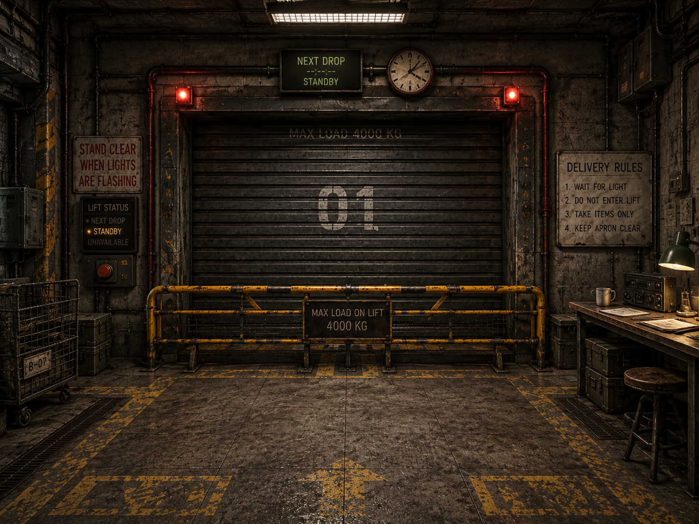
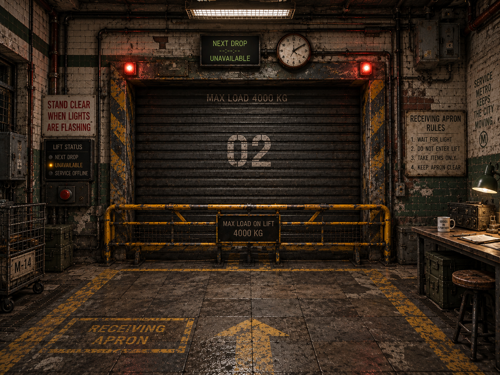
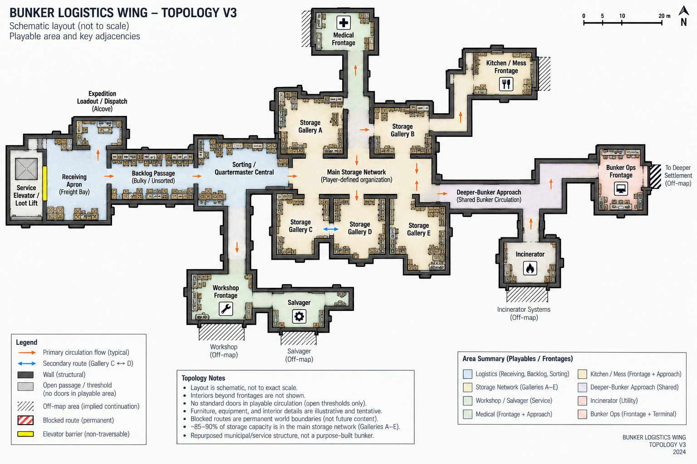
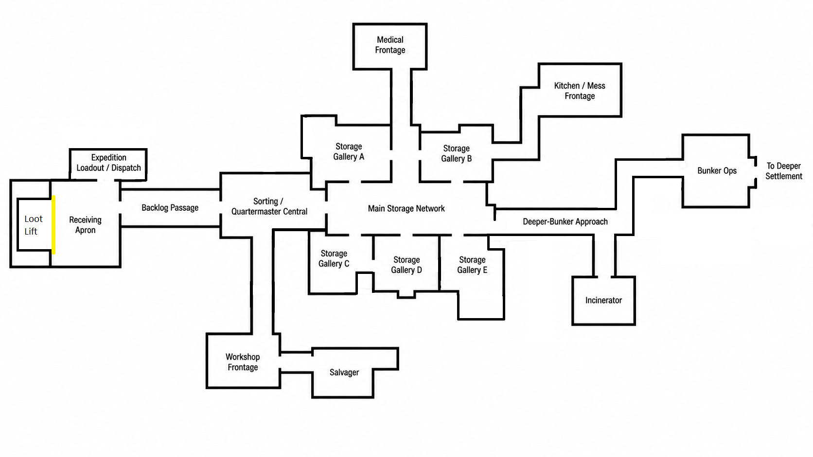
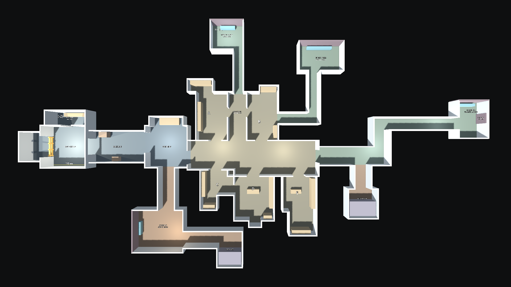

# Sorting Apocalypse Visual Design & World-Building Direction v0.9

> Generated text/table/image extract of the same-named DOCX master. Content order, headings, tables and original image references are retained; Word pagination, headers and text styling are not reproduced. Edit the master and regenerate; this mirror is not an independent authority.

SORTING APOCALYPSE

VISUAL DESIGN & WORLD-BUILDING DIRECTION

Unfinished / decommissioned underground service-level bunker

|  |  |
| --- | --- |

Receiving mood references - useful for layering, warmth, material contrast and functional composition. Wear/grime is an upper bound, not the production target.

Version 0.9 | 10 October 2026

Design basis: GDD v0.12; Prototype Findings v0.12; accepted current compact wing/Receiving geometry; promoted storage/ladder and Receiving Stage A/B; EAF1–EAF5; individually accepted C1 slices and initial manual wear.

| CORE VISUAL PROMISE  The bunker should look like a real underground municipal/service structure that has been occupied, adapted, repaired, and organized for years - not like a purpose-built survival base. The player should be able to read what the structure used to be, what later builders changed, what survivors adapted, and what the Quartermaster has made orderly. |
| --- |

## 1. Purpose, authority, and status

Version 0.9 preserves the accepted world history, spatial relationships, images and governing design principles while reconciling current Receiving construction and completed EAF4 editor authoring. GDD v0.12 owns gameplay/design/scope; Findings v0.12 records evidence. C1 remains IN PROGRESS with its initial manual wear pass human-reviewed and merged; Stage C remains future.

This document governs world-building, environment architecture, composition, material/surface grammar, lighting direction and production protocol. Gameplay, storage, progression and interaction remain with the GDD and accepted records. Technical validity, approved source/use and specific human art acceptance are distinct; this revision does not promote new mechanics.

Sections 29 and 31 retain the original schematics and accepted September overview unchanged as design-history/relationship references. Current accepted builder and saved geometry, including the compact October retrofit, govern working dimensions over older pixels. EAF5 remains historical proof evidence, superseded for the Receiving production wall role by P05_C02.

| Status | Meaning | Use in this document |
| --- | --- | --- |
| CONFIRMED | Design baseline | Locked world-building/art-direction rules and production constraints. |
| DIRECTION | Preferred solution | Current spatial or visual recommendation to validate in-game. |
| OPEN / TBD | Unresolved | Exact interaction object, progression timing, balance, labels, dimensions, or topology still requires design/playtesting. |

## 2. Core world premise and identity

| METRO-ORIGIN TEST  The facility's transit ancestry should be archaeological, not iconic. An average player should read “old underground service / municipal infrastructure,” not “subway platform.” A civil or rail worker may recognize the deeper ancestry. |
| --- |

### 2.1 What the bunker was

The survivors occupy part of an unfinished or decommissioned metro-service / maintenance-level construction project. The playable area is not a passenger station and does not expose passenger or rail infrastructure. There are no tracks, platforms, ticketing systems, commuter wayfinding, or long train-tunnel spaces dominating the play area. Collapsed or unfinished tunnel heads may imply civil-engineering continuation without making the player feel that they are standing on a subway platform.

### 2.2 Construction chronology

The visible pre-apocalypse construction spans roughly 30-50 years of mostly late-20th-century civil/service work, interrupted by halted construction, partial resumptions, repairs, and later upgrades. The site was mixed-status before the apocalypse: some completed service areas still received occasional maintenance or utility access, while unfinished expansions and abandoned branches had already been neglected.

- No World War II bunker visual language.

- No futuristic or sci-fi construction language.

- Changes in materials or methods should usually occur at believable construction-phase, repair, or functional boundaries.

### 2.3 Survivor occupation

The settlement has been established for several years. Survivors have had time to organize, patch, label, furnish, ventilate, and operationalize the space, but not to comprehensively renovate it. Major structural work by the survivor community is uncommon. Their skill is expressed through competent adaptation of limited and mismatched resources.

| IMPROVISED DOES NOT MEAN SLOPPY.  Survivor work can be mismatched, ugly, or clearly salvaged while still being structurally sound, logically routed, firmly mounted, and professionally competent. |
| --- |

### 2.4 The apocalypse is context, not decor

The bunker remains a safe haven. The game deliberately shelters the Quartermaster from the surface threat; the player knows the broader zombie-apocalypse premise, but the playable environment does not constantly advertise it. Scarcity, expeditions, repairs, requests, blocked infrastructure, and salvaged objects imply the world state. Routine gore, zombie warnings, combat fortifications, traps, or militarized interior checkpoints would pull focus away from the logistics fantasy.

| REMOVE THE MARKETING CONTEXT TEST  Without knowing the zombie premise, the bunker should still read as a resource-constrained underground community keeping an old facility operational. Knowing the premise should make the same details acquire deeper meaning. |
| --- |

## 3. Historical and visual layers

| Layer | Visual meaning |
| --- | --- |
| Layer A - Original civil/service infrastructure | Concrete, masonry, selective tile/paint, drainage, utility systems, structural bays, old safety/service markings. |
| Layer B - Interrupted construction and later upgrades | Unfinished openings, capped services, material transitions, newer electrical/mechanical additions, repairs, partial commissioning. |
| Layer C - Survivor adaptation | Furniture, patched services, ventilation, shutters, barriers, scavenged equipment, competent improvised installations. |
| Layer D - Quartermaster order | Labels, work zones, storage decisions, clear lanes, paperwork, staging, shelf logic, accumulated logistics habits. |

The layers should remain visually distinguishable. A later layer sits on top of the older structure; it should not erase the evidence that the older layer existed.

## 4. Governing art-direction principles

### 4.1 Readability before spectacle

Environment art supports fast recognition, item retrieval, storage planning, route memory, and interaction. Atmosphere must not obscure shelves, hatches, carried items, request interfaces, or floor circulation.

### 4.2 Low-detail realism, not photorealism

Use strong silhouettes, convincing construction logic, restrained materials, decals, repeated modules, and a limited number of landmark structures. Concept images are composition/mood references, not a fidelity target.

### 4.3 Efficiency is an aesthetic

Clear routes, shallow readable shelves, sensible staging, work zones, and repeatable infrastructure make the Quartermaster fantasy satisfying. Disorder exists, but the environment itself should reward organization.

### 4.4 One bunker, distinct operational districts

The underlying shell remains architecturally continuous. Departmental service spaces also have distinct footprint and approach characters, not the same rectangle repeated with different props. Later lighting, equipment, maintenance, signage and services reinforce identities already supported by the greybox.

### 4.5 Rational architecture, historically caused irregularity

The original facility makes engineering sense. Irregularity comes from halted construction, later upgrades, collapses, awkward annexes, repairs, service penetrations, and years of occupation - not arbitrary level-design geometry.

### 4.6 Structurally trustworthy core

Occupied areas feel worn but dependable. Serious collapse, heavy water damage, or visibly unsafe structure belongs mainly at abandoned edges and blocked continuations.

## 5. Universal material and surface grammar

| THE BUNKER ENVELOPE IS PRIMARILY MINERAL, NOT METALLIC.  Concrete, cement/render, masonry, blockwork, and occasional brick form the building. Metal belongs mainly to reinforcement, shutters, barriers, gratings, pipes, vents, trays, rails, plates, and later infrastructure. |
| --- |

### 5.1 Layered surface hierarchy

1.  Structural substrate / structural surface - concrete, cement, block, masonry, occasional brick, and exposed slabs, beams or columns with their chosen visible material. This is the room's base visual identity.

2.  Applied finish - optional, historically caused paint, tile, render, patch cement, repair field or survivor infill. It is not a mandatory extra visible coating.

3.  Utility/service systems - pipes, conduit, vents, cable trays, electrical boxes, shutters, barriers, gratings and rails.

4.  Survivor occupation - furniture, shelving, lamps, electronics, containers, workstations and practical additions.

5.  Character/detail - wear, grime, localized rust, scuffs, mineral staining, decals, notes, signage and repair marks.

Choose a coherent mineral structural palette before adding finish. A room may pass its base material review with exposed structural material alone. Do not add paint, plaster, tile or contrasting rectangles simply to manufacture variation or rescue a weak structural palette.

An applied finish needs a plausible construction, service or repair cause: an old institutional paint field, cement/render, tile at a wet or service condition, a repair field, overpainted signage or localized later construction. Receiving's accepted NO_FINISH base is a room-specific example, not a bunker-wide prohibition.

| Every new visual layer should look applied to an older one, not as though the whole room was rebuilt in that style. |
| --- |

### 5.2 Wall families

- Concrete-dominant: rough cast, patched, painted, drilled/anchored, with limited damp or repair staining.

- Localized aged glazed tile or institutional service finish where function/construction phase supports it.

- Painted blockwork or masonry in cheaper/later utility areas.

- Survivor plywood, timber, mesh, or corrugated sheet used mainly as patching, infill, partitions, shutters, or retrofit - not as the primary shell.

### 5.3 Floors

Poured concrete is the dominant circulation surface, but a single obvious repeating concrete tile must be avoided. Variation should come from different pours, subtle aggregate/color changes, expansion joints, repairs, traffic wear, drainage, trench covers, short grating sections, steel plates, old safety paint, and survivor operational markings. Large quiet areas remain valuable.

Broad restrained tinted-opacity scalar layers can vary a repeated base material without choosing a new concrete texture for every room. They remain flat editable overlays; changes in underlying pours, joints or construction still need their own plausible history. This technique does not establish seamless mask tileability or alter substrate roughness/normal response.

### 5.4 Paint

Most visible architectural paint belongs to the pre-apocalypse facility: faded institutional green/blue/cream, old safety yellow, bay markings, door surrounds, utility identifiers, and partial color bands. Survivor-applied paint is sparse, newer, rougher, and functional: keep-clear boundaries, hazard edges, storage marks, arrows, or quick labels. Whole-room survivor repainting for aesthetics is out of character.

## 6. Wear, cleanliness, moisture, and irregularity

| Wear is causal, not a uniform “grunge pass.” Active spaces are worn, irregular, and imperfect, but visibly maintained enough to support daily work. |
| --- |

| Cause / location | Expected visual evidence |
| --- | --- |
| High-use contact | Scuffed routes, worn edges, polished/dirty touch points, chipped corners, tape residue, furniture rub. |
| Environmental exposure | Localized mineral staining, rust around fasteners/pipes/drains, grime at wall bases and penetrations. |
| Neglected edges | Heavier dust, corrosion, debris, failed fixtures, older water marks, abandoned construction residue. |
| Maintained work zones | Usable work surfaces, clear walking paths, repaired or isolated serious damage, less accumulated dirt. |

Moisture is localized evidence of being underground, not the bunker’s dominant atmosphere. Active areas are generally dry and habitable. Seepage, puddling, mineral trails, damp corners, and heavier corrosion concentrate around drains, old joints, damaged sections, or abandoned branches.

APPROVED SOURCE/USE ≠ ACCEPTED SCENE COMPOSITION. Local dust, rust, leakage or damage needs a plausible cause, surface and orientation. Broad subtle scalar variation can also break repeated concrete/material patterns and support consistent material reuse across rooms. Its distribution can express construction and accumulated use without requiring every mark to be a tiny crack/chip or an exact microscopic placement. Keep both broad variation and local wear restrained, readable and editable.

The completed human-accepted EAF4 workflow provides eleven standalone conventional presets with live independent dimensions, transforms and appearance, duplication and safe save/reopen. The separate sixteen-source scalar library supports flat tinted-opacity layers and approved opacity modulation; normal authoring does not require gameplay. Infrastructure, furnishings and representative lighting provide the context for localized wear, and later tuning remains ordinary room authoring.

| IRREGULARITY TEST  The player should be able to imagine why neighboring things do not match. The explanation need not be stated, but one should plausibly exist. |
| --- |

## 7. Lighting and color

| Functional coverage without fixture uniformity.  The bunker is lit by accumulated working solutions, not by a designer who specified one fixture schedule for the entire building. |
| --- |

Warm-to-neutral light should dominate ordinary occupied areas. Cooler fluorescent/service fixtures remain part of the mix but should not define the bunker. Replacements do not have to match older fixtures. Task lights, wall lamps, commercial fixtures, and survivor replacements can coexist. Harsh uniform industrial light should be limited because it is tiring, visually unforgiving, and pushes the world toward lab/military/warehouse language.

- Receiving: warm/neutral general light plus industrial task and warning accents.

- Sorting: comfortable work lighting with good monitor/surface readability and warmer local task sources.

- Storage: calm, legible shelf illumination; avoid deep item-obscuring shadows.

- Medical Supply Anteroom: somewhat brighter/neutral, but never overexposed clinical white.

- Workshop/service leg: more directional industrial sources, still avoiding blanket harshness.

- Unused/dead branches: reduced coverage, spill light, failed/absent fixtures, but not horror-game blackness.

Architecture stays mostly neutral: concrete grey, dirty off-white/cream, faded green/blue, dark steel, oxidized metal, plywood/wood, and safety yellow. Strong color belongs to functional accents, warning lights, facility identity, loot, and restrained Quartermaster labeling.

Neutral Calibration is the standard material and architecture review context; Receiving Target Preview is a target-context comparison. Neither defines the final fixture schedule. Review the structural/material composition in neutral light before using atmosphere, and do not turn the EAF1 WallGrazing diagnostic into production lighting direction.

## 8. Signage, labels, humor, and human traces

| Generation | Character |
| --- | --- |
| Legacy facility signage | Sparse. Utility IDs, hazards, load limits, construction/maintenance marks, partial bay numbers. The project was never fully finished, so polished wayfinding is limited. |
| Survivor operational signage | Hand-painted/printed instructions, warnings, return procedures, scavenged signs reused pragmatically or humorously. |
| Quartermaster organization | Most systematic and readable layer: restrained labels, tags, category cues, staging instructions and storage references. Exact player-labeling mechanics remain TBD. |

Humor should be dry, situational, and human rather than zany or meme-heavy. A scavenged road sign, passive-aggressive maintenance note, absurd old prohibition sign, or sarcastic label can work because it feels like something residents chose to keep. Do not turn every wall into a punchline.

### 8.1 Workplace first, domestic traces second

The logistics floor is a workplace that has gradually become the Quartermaster’s de facto living space. Appropriate traces include a small sink, mug, plates/cutlery, thermos, coat, pens, notebooks, a comfortable chair, a hardy plant, or a few personal notes. There is no dedicated bedroom, lounge, or recreation corner in the playable logistics wing. Personal objects should usually have a practical reason to be where they are.

## 9. Authored-world and unseen-community rules

| The playable environment is authored and spatially persistent. Decorative storytelling objects do not autonomously move, appear, disappear, or get cleaned up to simulate unseen NPC activity. |
| --- |

Physical changes occur only through explicit player-legal actions or designed system transitions. Unseen residents are communicated through requests, audio, hatches, lights, deliveries, machinery state, one-way messages, and static environmental evidence - not ambient prop simulation.

The bunker leader is referred to as the Administrator. The Administrator and other residents remain physically off-screen. One-way operational messages may carry tutorials, upgrade confirmations, exposition, warnings, and personality; the Quartermaster does not need branching dialogue or visible NPC conversations.

Physical storage installation is also authored world state. The developer selects furniture, placement, dimensions, level distribution, per-instance Front and ladder availability/placement. The player changes zones, labels and daily organization within those installations; no free-build mode is implied.

## 10. Universal environment-production protocol: the Foundation Gate

| Every major space must independently pass Layer 1 - Structural Shell and Layer 2 - Applied Finish before later services, furniture, dressing or final lighting carry the composition. Layer 2 may pass with coherent exposed structural materials and no added finish. |
| --- |

### 10.1 Layer 1 - Structural Shell

- Dimensions and proportions; floor/ceiling levels; walls and major openings.

- Recesses, alcoves, columns, beams, circulation, sightlines, and relationship to implied off-map spaces.

- Assign credible construction ownership at joins. Prefer clean face ownership, avoid visible coplanar overlap, and use through/butt joints where the build logic supports them. Faces completely concealed by adjacent opaque construction may be omitted; standalone pieces remain closed solids by default.

- An accepted gameplay topology may receive a production visual-shell substitution without spatially rebuilding the room. Preserve openings, circulation and sightlines unless later focused evidence calls for change.

- Architecture must make sense before attractive equipment, clutter, or lighting is added.

- Human visual approval required during prototype environment development.

| Layer 1 review question: Does this feel like a plausible part of the underground facility before we add anything interesting to it? |
| --- |

### 10.2 Layer 2 - Applied Finish

- Choose the visible structural wall, floor and ceiling materials as one coherent room palette, at plausible physical metres-per-repeat.

- Add paint, tile, render or repair fields only where history or function causes them; no extra applied coating is required.

- Review baseline surface character and construction-phase transitions without relying on later contextual wear to make the palette work.

- Review on standardized geometry under Neutral Calibration and relevant target-preview lighting before relying on final atmosphere.

- Human visual approval required before later passes.

| Lighting may enhance a good material composition, but it must not be used to hide a bad one. |
| --- |

### 10.3 Later layers

1.  Layer 3 - Services / infrastructure: pipes, vents, conduit, machinery, barriers, shutters, functional lighting.

2.  Layer 4 - Survivor occupation: furniture, workstations, storage, practical additions.

3.  Layer 5 - Character/detail: signage, notes, small props, humor, localized grime and storytelling.

The Foundation Gate remains a production-art checkpoint. Functional storage and the Stage B Receiving presenter were promoted in neutral geometry before final room materials; that interaction success did not promote the art layers. Receiving C1 has now installed its accepted P05_C02 envelope and compact geometry, with further individually accepted lighting, furnishings and initial manual wear. EAF5 remains historical proof evidence. Human visual review governs later room changes; C1 remains IN PROGRESS.

EAF5 confirms that the gate separates structural shape, structural surface material, optional applied finish, localized wear and lighting. These owners can be revised independently. Human visual approval remains the gate; a technically valid material or mesh is not automatically right for a room.

## 11. Spatial and architectural grammar

- Human-scale service spaces: Most areas are larger than domestic rooms but remain contained and practical. Receiving, junctions, and machinery bays can be selectively larger; dead ends may tighten.

- Mixed exposed services: Original infrastructure is partly concealed and partly exposed. Survivor additions are often surface-mounted. Not every wall or ceiling needs pipes, vents, or cables.

- Exposed structural ceilings: Concrete slabs/beams remain visible; services and fixtures accumulate selectively below them. Uniform dropped ceilings are rare.

- Visible modularity: Structural bays, wall joints, floor joints, columns, ceiling spans and service standards may repeat. Repairs, later phases, local function and survivor adaptation selectively disrupt the rhythm. Initial greybox geometry should favor a small number of purposeful orthogonal offsets, bends, and width changes; small incidental wall niches/alcoves can be added later case by case once the main structure is proven.

- Controlled access without militarization: Heavy doors, locks, shutters and barriers appear only where function requires them. Normal playable circulation defaults to open thresholds/doorways without routine operable doors, preserving flow and sightlines. Fixed closures are reserved for off-map boundaries, blocked continuations, freight machinery, and similarly justified hard limits.

## 12. Core logistics relationship: Receiving → Sorting → Storage

The accepted working spine is Receiving -> Backlog Passage -> Sorting / Quartermaster Central -> Main Storage Network -> Deeper-Bunker Approach. Its thresholds, proportions and offsets have passed human greybox review. Preserve this in-engine layout unless a specific later interaction or furnished-clearance test justifies a change; the sequence is not a mandate for a straight corridor. [A17]

### 12.1 Backlog transition

The passage between Receiving and Sorting may be intentionally widened to carry static “I’ll get to that tomorrow” environmental backlog: tarped pallets, stacked car tires, a broken chair over boxes, a washing machine, obsolete equipment, or other bulky non-loot objects. These props should be clearly distinct from catalogue loot through scale, form, wrapping/tarping, lack of gameplay Utility/category fit, or obvious furniture/machinery identity. A comfortable walking lane remains clear.

| Receiving = incoming uncertainty. Backlog passage = unresolved leftovers. Sorting = temporary deliberate staging. Storage = resolved organization. |
| --- |

## 13. Receiving Apron / Freight Bay

Receiving is a former freight/service loading point adapted into a goods-transfer interface. It is somewhat rougher and more overtly industrial than Sorting/Storage, but the permanent concrete/masonry structure remains visually dominant. The service elevator itself is the only spatial implication of the surface/outside-world conduit: there is no playable lateral surface-access route, signage, or explanatory corridor beside the lift.

- Architecture first: adapt freight equipment to the existing accepted aperture and surrounding wall, not the room to a prefab doorway. Dispatch is the accepted shallow external annex beside Receiving with its own doorless opening; keep its usable volume distinct from the apron. It is not a new destination corridor.

Current compact Receiving nominal dimensions are 8.00 × 7.50 m / 60 m²; Dispatch is 6.50 × 3.50 m with a 2.40 m doorway. The centred Backlog opening is 2.84 × 3.40 m. Current saved geometry governs these proportions and working lanes (§34.7).

- Wide and shallow: Construct a distinct rectangular freight enclosure behind an aperture in the Receiving west wall. Solid room-wall sections flank the opening; the cage has its own inset rear wall, side walls, floor and ceiling. The rear of the cage is not the apron's surrounding wall. A permanent barrier keeps the shallow bay inaccessible; no route around the cage is implied. [H16]

- Barrier: A strong example of competent survivor improvisation. It may combine repurposed industrial parts, but must look firmly anchored and intentional.

- Shutter: Heavy, simple, mechanically understandable, battered but functional. Corrugated/segmented metal belongs here because it is equipment, not the shell.

- Floor: Concrete with repair patches, drainage/trench/grate interruptions, faded hazard/keep-clear markings and cart/freight wear.

- Services: Moderate and localized around freight machinery, one service wall, or ceiling edge. Leave significant concrete surfaces visually quiet.

- Wear: Usage wear more than neglect; the inaccessible freight recess can be somewhat rougher.

- Signage: Load limits, bay ID, emergency stop, concise receiving rules, sparse Quartermaster notes, occasional scavenged humor.

The promoted Stage B TAKE-only presenter arranges front crates, rear pallets and loose deck cargo within a shallow permanent freight bay. Keep a clear player-side work apron and preserve the accepted presentation and interaction geometry as production fixtures are developed. Fixture-integrated Receiving-only TAKE reach is 3.4 m; it is a spatial/interaction constraint, not a visual invitation to enlarge or clutter the bay.

Receiving production uses P05_C02: the approved constructed/panel wall, Worn Concrete Floor and shuttered/formwork ceiling. Base applied finish, structural secondary and fixed base wear preset remain NONE; these base choices do not exclude independently authored wear layers. The EAF5 P01_C02 primary/P05_C03 alternate remain historical proof selections (§34).

### 13.1 Sorting sightline

The accepted desk/aperture relationship provides a partial lift view with interrupted full-core and Storage-to-Ops vistas. Round three restored Backlog/Sorting proportions and adjusted the northern opening edge with explicit approval. Preserve the geometry and real work stance. Stage B has now established deterministic cargo identification and fixture-integrated physical TAKE reach in its promoted scope; production freight equipment, cargo and lighting must retain legible player-side views without treating the earlier pile experiment as a live gate. [A17]

## 14. Sorting / Quartermaster Central

| Sorting is not a destination room. It is a widened logistics passage that the Quartermaster appropriated because it sits directly on the Receiving → Storage route. |
| --- |

- Sorting table: Wall-fitted, wide and fairly shallow, clear flat gameplay surface. Accessible from its west, south, and east edges; approximately 0.5 m clearance is a useful schematic minimum, but exact clearance is a greybox variable. No chair and no decorative loot-like clutter on the usable surface.

- Monitor/clock: Wall-mounted or ceiling-hung rather than consuming the sorting surface. Ordinary commercial/office equipment, not command-center hardware.

- Spatial relationship: retain the accepted desk stance and turns toward Receiving and Storage. Stage B proves item identification and fixture-integrated unloading in the accepted Receiving presentation; later furniture and lighting must preserve that useful view or trigger focused review.

- Personality: A small sink and personal/practical effects may sit to one side of the sorting table, with a small auxiliary desk/work surface, filing cabinet, or equivalent to the other. If those elements would force the passage to grow into a room, move some of them to the opposite wall rather than enlarging Quartermaster Central.

- Infrastructure: Restrained; the scene is already information-dense. Quiet wall/ceiling surfaces are valuable.

- Starting state: Functional but imperfect, reflecting an experienced Quartermaster with established routines and a backlog of “tomorrow” tasks.

## 15. Storage galleries and alcoves

| Storage is an adapted architectural condition, not a purpose-built stockroom. The Quartermaster fits capacity into inherited underground geometry and works around pillars, beams, wall jogs, ceiling constraints, and circulation compromises. |
| --- |

The main Storage network should contain roughly 85-90% of total storage capacity across five partially enclosed but visually connected galleries/alcoves, A-E. The remaining 10-15% can appear as opportunistic satellite storage elsewhere in the bunker: a small former technical room converted to secure lockers, a squat shelf under a beam, a clothes rail along a useful wall, or other architecturally constrained units.

- Circulation: One bent/variable-width primary storage spine plus one deliberate short secondary connection between Gallery C and Gallery D. This creates one useful loop without becoming a ring, grid, or maze. Gallery E remains primarily single-entry and is not a shortcut into the Deeper-Bunker Approach.

- Partial enclosure: Existing walls, columns, offsets, broad doorless openings and restrained orthogonal wall jogs create distinct pockets while keeping adjacent areas perceptible. Irregularity should be purposeful and buildable; avoid puzzle-like outlines or decorative micro-alcoves in the initial shell.

- Access vs capacity: preserve the single C-D secondary link and the accepted A-east/B-west openings to shared Main Storage circulation. Medical is reached from that connector without entering A; Kitchen is reached through B-east. Retain no direct Medical-Kitchen shortcut and no E-to-Deeper bypass. These accepted relationships supersede conflicting early schematic/prose rules. [A17]

- Shelf placement: Predominantly perimeter/wall fitted, but gameplay usability governs. Wall shelves should be shallower; deeper units belong where the player can walk around them.

- Facing: Front is semantic metadata authored per installation, not inferred from which open side appears to be the front. Different instances of the same furniture family may use different Front states.

- Stored presentation: Default labels and presentational faces should read toward unit Front when their canonical item pose is authored that way. A 90-degree packing choice may intentionally turn them sideways.

- Do not author per-item shelf-family rotation hacks or mutate imported source orientation to repair one installation's presentation.

- Freestanding units: Generally low-to-medium height to preserve sightlines. Taller islands are exceptions proven through first-person testing.

- Shelf height: ordinary ground-access storage still needs reliable visibility, targeting and retrieval from supported standing approaches. Selected authored taller installations may use the human-promoted fixed-ladder architecture where a deliberately installed ladder serves the shelves. This does not make every high shelf, rack or route ladder-accessible.

- Furniture language: Coherent backbone of a few repeated general-purpose families, supplemented by scavenged cupboards, lockers, crates, low units and specialist storage.

- Player agency: Main galleries have soft spatial affordances but no predetermined category identity. Gallery A is convenient/near Sorting; B is farther along the inhabited side; C is relatively long or mildly dog-legged; D is the central irregular gallery with the C connection; E is the constrained far-side pocket near the deeper-bunker transition. These shapes aid spatial memory without prescribing taxonomy; the player supplies the categories.

### 15.1 Storage upgrades and sockets

Storage capacity is spatially authored. Every shelf, locker, rack, cabinet, or other storage unit occupies a predetermined socket. Progression can install/activate units at those sockets; there is no free-form shelf placement. If movement is later allowed, it should be constrained to specific unit/socket relationships rather than arbitrary building.

Each installed unit also carries an authored semantic Front. Progression may install another instance of the same furniture family with a different Front state when the architecture requires it; the state belongs to the installation, not the mesh family.

Future sockets are mostly implicit. Some are empty; others may contain authored placeholder clutter such as obsolete equipment, broken furniture, tarped material, or construction leftovers. Upgrades occur during the nightly transition, allowing the placeholder clutter to be removed and the new unit installed without visible pop-in or animation. The player should not see glowing upgrade pads or painted “future shelf” markers.

The starting amount of installed physical capacity is moderate. The quantity of pre-seeded loot at new game remains an economy/balance TBD and is intentionally not specified by this visual document.

## 16. Dedicated service spaces and inner facility boundaries

| VISIBLE SUPPORT SPACE, UNSEEN STAFFED CORE. Workshop / Kitchen service rooms and the Medical Supply Anteroom are playable; Bunker Ops is an open Transfer Landing. Opaque inner boundaries exclude only the staffed operation, not the support-space footprint. |
| --- |

CONFIRMED  Workshop and Kitchen have dedicated player-accessible service rooms; Medical has a Supply Anteroom. Bunker Ops uses a more open, dedicated Transfer Landing. These are supporting departmental spaces that plausibly need no continuously visible worker, not staffed workplaces emptied of people. Their functions include material handoff, equipment support and limited staging, rather than overflow storage alone. [D16S]

The staffed fabrication floor, treatment ward, cooking/mess interior and administrative office remain unseen behind opaque inner boundaries. A service room may be a genuine room that the Quartermaster enters. Do not replace it with a corridor hatch, a row of consoles, or a solid off-map block occupying its playable footprint. Furnishing and delivery choreography are later milestones, not prerequisites for the current geometry revision.

### 16.1 Three separate boundaries

| Boundary | Player-facing meaning | Greybox obligation |
| --- | --- | --- |
| Territorial | The player enters department-owned support space. | Open traversable entrance / defined landing edge; room identity cannot depend on a door blocking entry. |
| Material ownership | Supplies transfer only through an explicit legal submission action. | Reserve a plain labelled interface envelope at the inner boundary. No interactions or automatic room-entry consumption in this milestone. |
| Playable world | The staffed operation stays outside the playable domain. | Continuous opaque inner wall / fixed closure behind usable room floor. No accessible operational core or exposed empty room beyond it. |

### 16.2 Distinct footprints; bounded implementation scope

Workshop remains a broad room-like support space; Kitchen an elongated catering-service room; Medical an anteroom widening west of its aligned corridor wall; Bunker Ops an open dedicated transfer landing. Their accepted footprints and approaches distinguish the destinations. Use the saved geometry as the working dimensional baseline, not the original schematic pixels. [A17]

The neutral geometry provides enclosing floors/ceilings, wall thickness, open territorial entrances, inner boundaries and essential proxy masses. The completed continuing-gameplay integration uses only the functional fixtures needed to test handling. Departmental furnishing, hatch mechanics, delivery choreography and final audio/lighting remain later work; no speculative asset acquisition or four bespoke interaction systems are required. [D16S, D17B]

Department ownership is not a new inventory rule. These spaces add no implicit free Quartermaster capacity, retrievable departmental reserve, automatic submission or autonomous prop handling. Existing utility lanes, request consequences, Workshop projects and output rules are retained.

## 17. Workshop Service Room / service leg + Salvager

Workshop occupies an infrastructure-heavy service branch from Sorting/early Storage, not through Gallery C. The accepted room is a broad playable equipment/project-material support space with a distinct opaque inner boundary to the unseen staffed Workshop. Retain the separate Salvager path and ordinary continuous southern wall; no abandoned continuation or reserved opening remains. Furniture and final staff-door/interface placement are later decisions. [A17, D16-R02]

- Footprint and arrival: Preserve the branch's restrained bend and a clear open entrance into the wider service room. One purposeful orthogonal offset may shape equipment support and circulation; do not invert intended solid wall mass into an accidental nook. Reserve usable standing/turning floor at the future intake.

- Later occupation: Department-owned non-loot equipment and staging can occupy the room's edges. Existing asset families are considered sufficient by the developer; exact selection and furnishing are deferred. Do not fill the main approach corridor to manufacture Workshop identity.

- Workmanship: Competent installations using mismatched/scavenged resources. Avoid Mad Max / junk-tech aesthetics.

- Services: Densest active-area service exposure: electrical feeds, extraction, conduit, sockets, junctions, ventilation, compressed-air-like lines, but still clustered with quiet concrete surfaces retained.

- Lighting: More industrial/directional than Storage, still avoiding blanket harshness.

- Audio / staffed-core limit: Later localized service sound can imply work beyond the inner wall. Do not expose an empty staffed production setting or add visible workers, ongoing NPC simulation or a new handling chore. Exact cues remain later scope.

### 17.1 Salvager

Retain the accepted bent/oblique Salvager spur, front-operated machine envelope and current approach reveal. These are spatial baseline decisions, not proof of functional machinery or final assets. The former adjacent abandoned continuation has been removed completely; no replacement is reserved in the Workshop district. [A17, D16-R02]

## 18. Medical Supply Anteroom

| Medical has protected usable support space. Clear floor is intentional; the player enters the Supply Anteroom but never the treatment ward. |
| --- |

Medical is reached without crossing a gallery: the full A/B connector belongs to Main Storage, followed by a 10 m Medical-exclusive protected corridor. The anteroom keeps its 7.8 x 7.0 m nominal size, lies north of that corridor and widens westward; its eastern wall continues the corridor wall and entry is at the south-east. This accepted arrangement keeps the shared circulation, departmental buffer and opaque staffed-core boundary distinct. No direct Medical-Kitchen route is introduced. [A17]

- Protected territory: The approach and anteroom are not Quartermaster storage-expansion or backlog sockets. Preserve clear floor as intentional departmental support space, even before later equipment is selected. Crossing the outer room threshold does not submit supplies.

- Finish: Better maintained, not newer: painted concrete, limited old tile, repaired chips, restrained stains, comparatively clean floor/wall bases.

- Lighting: Somewhat brighter/neutral but not clinical; fixture mismatch remains acceptable.

- Infrastructure: Low exposed-service density, neatly routed conduit/ventilation, little heavy machinery.

- Later equipment / scope: Restrained non-loot supply and equipment support may establish Medical identity. No visible ward, beds, patients, empty reception desk or theatrical quarantine sequence is required. Exact furnishing and submission mechanism are deferred.

- Signage: Clear but restrained Medical identity; avoid giant red-cross theming.

## 19. Kitchen Service Room / unseen Kitchen and Mess

The player enters a dedicated catering-support service room, not cooking stations or a mess hall with its occupants removed. The unseen operation remains led by a competent chef and supported by staff; its social and working life is implied beyond the inner wall. The accessible room supports meal supplies and the existing ration-related functions without adding a new cooking or service chore. [D16S]

- Spatial position: The approach leaves Gallery B through its eastern doorway under the developer's round-one correction. This explicitly replaces the former no-gallery-mediated Kitchen route. Preserve the modest separation from Medical and dirty machinery; no direct Medical↔Kitchen connection is added. [H16]

- Footprint: retain the accepted elongated service-room floor, east-then-north approach and usable arrival. The staffed kitchen/mess boundary is the inner wall, not the entrance. Exact furnishings and interface placements remain open; do not change the accepted room dimensions without new gameplay evidence. [A17]

- Finish: Used and repeatedly cleaned: painted concrete, partial tile, repaired floor, scrubbed wear, localized grease/water staining without domestic grime.

- Lighting: Warmest inhabited service space; later warm spill plus practical neutral coverage. Human warmth without café/home-kitchen styling; greybox review remains neutral.

- Services: Later extraction, plumbing and electrical concentration belong near the inner facility boundary. They must not be needed to explain where the playable service floor ends.

- Later equipment: Department-owned catering/service equipment can reinforce identity without resembling accessible Food/Hydration loot. Prop roster and placement remain deferred; do not interpret decorative equipment as edible reserve, free Quartermaster storage or usable ration output.

- Community cues: Later restrained audio, practical notices and equipment relationships imply the occupied kitchen/mess beyond the wall. Static background objects remain authored; no unseen-tray-collection simulation or routine prop rearrangement is introduced.

- Humor: Chef-authored supply notes or vague menu humor can target circumstances, not incompetence.

## 20. Deeper-Bunker Approach and Bunker Ops Transfer Landing

| Bunker Ops sits at a believable terminus of the playable logistics wing, where the architecture strongly implies that the settlement continues beyond the player’s accessible space. |
| --- |

The Deeper-Bunker Approach is the longest comparatively sparse active circulation leg in the playable wing. It begins somewhat wider as Storage/Quartermaster occupation fades, then narrows cleanly through a restrained orthogonal dog-leg and remains narrower on the final approach. The bend breaks the long warehouse-like vista, distributes points of interest over the route, and keeps Bunker Ops from sitting permanently in view from the Storage network.

- Transfer Landing: Use a more open, clearly bounded widening at the shared approach terminus. Reserve a modest material-handoff position along one side, with clear arrival and turning space. It is not a fourth enclosed storeroom or a furnished empty office. Supplies move onward to the wider unseen settlement. [D16S]

- Inner boundary: The future Bunker Ops intake belongs to an opaque departmental/distribution boundary at the landing's edge. Territorial entry, supply commitment and the inner world limit remain distinct. Exact counter, compartment, manifests and delivery mechanisms are later design, not this footprint milestone.

- Settlement continuation: A separate regular personnel-door-sized opaque closure sits within a surrounding wall beside/beyond the handoff. Do not make it the width of the entire terminal wall or route the player through the submission device. Nothing beyond it is modeled. Its operation remains off-map; no new operable-door gameplay is added. [H16]

- Lighting/services: Neutral/practical, low-to-moderate communications/electrical infrastructure, no command-center aesthetic.

## 21. Incinerator utility spur

Retain the accepted narrowed Incinerator pocket, front-operated machine envelope and southward spur near the end of the wider pre-bend Deeper approach. The balanced dog-leg and ordinary corridor buffer to Ops remain unchanged. Future machinery details must fit this working geometry or motivate a focused new review; no active Incinerator gameplay is implied. [A17]

- Scale: Massive, approximately 80%+ of local ceiling height, most of the back-wall width, minimal side clearance, front-operated.

- Integration: Major flue/exhaust, ventilation, heavy electrical feed, fuse/control cabinet, floor/wall penetrations and anchored base. It should read as installed plant equipment, not a large prop.

- Lighting: Practical service light plus localized machine-state accents; no room-wide red/orange horror treatment.

- Safety: Restrained but credible keep-clear, hot-surface, extinguisher, emergency cutoff and electrical markings.

- Progression: Not intended as a Day-1 system. Preferred fiction is that the machine physically exists but is offline/broken until Workshop repairs it during a later night transition. Exact unlock day remains balance/playtest TBD.

- Design meaning: No loot item is game-defined “junk.” Incineration asks the player to sacrifice real Utility for space/operational efficiency.

Administrator one-way messages can introduce the repair/unlock and reinforce the game’s hoarding tension with dry humor rather than presenting the machine as an obvious tutorial mechanic.

## 22. Blocked, abandoned, and dead-space continuations

| Dead spaces make the playable bunker feel like a constrained fragment of a larger structure. A blocked route should visually answer: “Why did this structure originally continue?” and “Why does nobody use it now?” |
| --- |

| Archetype | Design language |
| --- | --- |
| Structural collapse | One major dramatic collapse used sparingly. Broken concrete/rebar, crushed services, dust and deeper inaccessible volume. The active side remains safe. |
| Abandoned unfinished branch | Raw concrete, incomplete blockwork, exposed anchors/rebar, capped services, formwork/scaffold remnants, survey marks, old construction material. Work stopped; nothing necessarily collapsed. |
| Surrendered / junked service route | Physically intact but not worth reclaiming. Broken furniture, obsolete panels, bundled pipe, dead equipment, carts, insulation, fencing, discarded construction material. |
| Sealed / obsolete access (optional) | Intentional closure of an unused route through an old service door, welded gate, block infill, or plate. Should not read as anti-zombie fortification. |

No abandoned stub is part of the current accepted functional wing. The former Workshop-side continuation was removed completely and must not be restored beside Workshop, Salvager or another service space. Later consider roughly two or three stubs opportunistically, not as a current count, reserved footprint or required task. None may connect directly to or sit immediately adjacent to a departmental service space or the Bunker Ops Transfer Landing. Functional machine spurs and the active settlement door are distinct and remain. [D16-R02, A17]

- Provide a readable safe-side boundary through architecture, barrier, gate, closure, or debris geometry rather than arbitrary invisible collision where possible.

- Use heavier wear/neglect here than in active areas, but give each dead end one primary reason for its condition rather than generic destruction.

- Avoid placing recognizable inaccessible catalogue loot behind blockers. Dead-space props should be oversized, broken, embedded, tarped, crushed, or otherwise clearly environmental.

- Lighting can diminish into the abandoned volume, but should not turn every dead end into a horror-game secret area.

## 23. Progression-state implications for environment art

The visual world can change at explicit progression moments, particularly during the nightly transition, without violating the authored-world rule. Such changes are system-driven and persistent rather than ambient simulation.

A storage upgrade must preserve the authored installation contract for its new unit, including dimensions, level distribution, usable-area insets and semantic Front. These are deliberate persistent states, not ambient prop behavior.

- Storage sockets: Placeholder clutter may be removed overnight and a new shelf/locker installed at a predetermined socket. The transition does not need visible animations or live collision handoff.

- Large machinery: Incinerator and potentially Salvager can physically exist as offline/broken landmarks before their gameplay function unlocks. Later night transitions can activate/reconfigure them.

- Narrative confirmation: Administrator one-way messages can explain upgrades, repairs, tutorial milestones, and operational changes in a practical, familiar tone.

## 24. Technology and production implications

Survivor technology should remain recognizably contemporary and utilitarian: ordinary industrial/commercial equipment, office monitors, generators, panels, lights, fans, radios, UPS units, conduit and tools. Ingenuity comes from how familiar objects are integrated and maintained, not from bespoke sci-fi or “junk-tech” machines.

| If a plausible real-world commercial, municipal, office, or industrial object can do the job, prefer adapting it over inventing a fictional machine. |
| --- |

Retain Godot 4.7 Compatibility. EAF1 supplies material review, EAF2 metre-authored structure, EAF3 curated PBR sources and completed EAF4 live wear/scalar authoring. UV remains default. Simple native mineral structure and suitable sourced irregular equipment remain useful; separate geometry, surface and editable overlays.

Blender remains available for asset repair, specialized geometry and specific content work; routine structural substrate generation does not require it. Sourced shutters, barriers, rails, gratings, pipes, vents, machinery, infrastructure, furniture and dressing should serve their intended roles without forcing their mesh or material coupling to dictate room architecture.

Reusable ModularRack supplies a production-authoring grammar for functional rack installations, not one universal furniture design. Shelf wrappers remain ordinary local scene elements, per-edge insets remain installation-specific, and source GLB/FBX transforms must not be changed merely to make stored presentation face correctly.

## 25. Visual do / do not

| DO | DO NOT |
| --- | --- |
| Show the old underground service facility beneath survivor adaptations. | Make the logistics wing read as a purpose-built military bunker, warehouse shell, ship, laboratory, or sci-fi base. |
| Let concrete/masonry define the building; let metal define equipment/services. | Use corrugated/steel wall systems as the dominant room envelope. |
| Use rational construction and historically caused irregularity. | Create arbitrary bends, mismatched geometry, or material changes solely to make the level look “interesting.” |
| Use warm/neutral practical lighting with varied fixtures. | Hide poor materials behind dramatic lighting or blanket the bunker in harsh fluorescence. |
| Use wear where cause and use justify it. | Apply uniform grime, rust, damp, or post-apocalyptic damage everywhere. |
| Build distinct playable departmental support rooms / landing before the opaque staffed-core boundary. | Replace service-room floor with blocker boxes, repeat one themed rectangle four times, or expose empty staffed operational interiors. |
| Keep environmental props clearly distinct from gameplay loot. | Decorate inaccessible or backlog areas with recognizable loose catalogue items that imply false interactivity. |
| Preserve quiet surfaces and clear routes so loot remains visually dominant. | Fill every wall/ceiling/floor with permanent decorative noise. |
| Build coherent mineral structural palettes with quiet, low-noise surfaces. | Treat an approved material catalog entry as automatic approval for a room role. |
| Use clean construction ownership and omit fully concealed construction faces where appropriate. | Force irregular metal or material-coupled prefabs to define the permanent building envelope. |
| Give localized applied finish a historical, functional or repair cause. | Add broad contrasting finish fields only for variety or to rescue a weak base palette. |
| Place localized wear with reference to infrastructure, furniture and representative light; use broad subtle editable variation where coherent material reuse would otherwise expose repetition. | Blanket surfaces in decals/grime or apply one fixed wear preset to every room. |
| Review material scale and response under Neutral Calibration and target-preview lighting. | Use dramatic lighting to conceal weak material selection or default to triplanar mapping. |
| Use sourced irregular assets for equipment, furniture, services and suitable detail. | Let sourced detail overrule accepted spatial geometry or a room's structural logic. |

## 26. Universal visual acceptance tests

1.  Does the structural shell work as an underground service room before props, services and atmospheric light?

2.  Does the building envelope read primarily as concrete or masonry, with metal serving equipment and infrastructure?

3.  Can original construction, later upgrades, survivor adaptation and Quartermaster order be distinguished?

4.  Do material repeats read at plausible physical size in metres, including broad floors and walls?

5.  Is UV the default mapping, and is any triplanar exception documented and checked on large planes, corners and WallGrazing views?

6.  Is there enough quiet, low-noise surface area for loot, signs, circulation and interactions to remain legible?

7.  Does every noticeable applied finish have a historical, service, wet-area or repair cause?

8.  Can noticeable wear be traced to use, environment, structure or installed infrastructure rather than a uniform grunge pass?

9.  Does the structural/material composition still work under Neutral Calibration without dramatic lighting to hide weaknesses?

10.  Are structure, surface material, services, survivor occupation and detail visually distinguishable?

11.  Does functional light provide warm-to-neutral coverage with credible mixed fixture generations and readable items?

12.  Does each district belong to the same bunker while expressing its own inherited footprint and current use?

13.  Can the player enter support rooms, reach intended interfaces and read the separate opaque inner boundary?

14. For Receiving, does the active P05_C02 envelope, current compact geometry and widened fixed lift preserve a clear apron, freight readability and accepted circulation, with source/placement acceptance distinguished?

These are human visual-review questions, not automated pass/fail rules.

## 27. Historical next validation sequence - superseded by §34.8

HISTORICAL CHECKPOINT. This numbered sequence records the v0.5 path. The storage, ladder, Receiving Stage B and EAF1–EAF5 milestones it anticipated have since received their separate decisions. Section 34.8 states the current order.

1.  Close the promoted greybox administratively: consolidate current authority and acceptance, preserve evidence and verify repository synchronization. Do not start another general geometry correction round. [A17, D17B]

2.  Next, integrate several existing functional shelves and a small pre-seeded interactive loot assortment into the accepted wing. This is a gameplay/bootstrap bridge, not full-wing furnishing or production shelf layout. Retain the original test scene intact and keep neutral spatial review reproducible. [D17B]

3.  After the seeded TAKE/carry/store/retrieve/zoning/stacking loop passes in the wing, begin physical Receiving. Separately prove a small architectural/material section before expanding production art. No final materials are required for the bridge or Receiving prototype.

4.  Revisit specific furnished clearances and route usability only when functional shelves, carried items or later requests supply new evidence. Greybox approval establishes a usable spatial starting point, not final shelf capacity or balanced commute frequency.

5.  Keep exact service-room furnishings, staff doors, transfer mechanisms and delivery feedback in later milestones. Their roles and territorial/material/world boundaries are approved; no NPC interiors or decorative equipment roster is required now.

6.  Define exact storage upgrade/progression system and whether any specific units can move between authored sockets.

7.  Determine Incinerator and Salvager unlock timing through economy/storage-pressure playtesting.

8.  Define player labeling/category-marking mechanics; keep current art direction limited to diegetic, restrained readability principles.

9.  Balance production starting inventory separately. The forthcoming seeded bridge is a reproducible test fixture, not a Day-1 loot decision.

10.  Once shell/material language is proven, define the compact modular environment kit and any Blender/PBR structural-generation workflow actually needed.

## 28. Current direction summary

Sorting Apocalypse should present the Quartermaster’s world as a small, legible, heavily reused fragment of an unfinished underground civil/service project. The structure itself is concrete, masonry, old finish, interrupted construction, and rational municipal engineering. Survivors have occupied it for years and made it functional through competent but resource-constrained adaptations. The Quartermaster then imposes the cleanest layer of order on top of that inherited complexity.

Receiving remains the sole goods interface; Dispatch remains an alcove and Sorting a widened passage. The five-gallery Storage network has one C↔D secondary link. A-east/B-west open to shared circulation; the protected Medical spur enters its Supply Anteroom, and Gallery B east feeds the separate Kitchen Service Room approach. Workshop has its own service room and accepted bent Salvager spur. The dog-legged eastern approach reaches an Incinerator spur, then an open Bunker Ops Transfer Landing with a separate settlement door. [H16, D16S]

The bunker becomes richer through player organization and restrained authored history while its shell and working lanes stay legible. Storage authoring, fixed ladder and Receiving Stage A/B remain promoted. C1 has accepted structure/material, compact geometry, lift/deck, lighting, manual furnishings, passive display/signage and initial manual wear. Further C1 room finish remains open; physical Stage C pressure/theatre is future.

Current environment owners remain structural shape, surface material, editable finish/wear layers and lighting. UV is default. Receiving uses P05_C02 with base finish/secondary/fixed preset NONE; broad scalar variation and local causal wear are separate editable art tools. Historical EAF5 palettes do not override current production (§34).

| FINAL VISUAL TEST  A representative screenshot should make an average player think: “Old underground service infrastructure that people have been living and working in for years.” It should not primarily read as subway station, military bunker, warehouse, spaceship, laboratory, or ruined zombie level. |
| --- |

## 29. Retained topology schematics and current interpretation

These two images are retained unchanged from 15 September. They explain design origins, gross relationships and early structural intent; they are not the current measured layout. Accepted in-engine refinements, service-room boundaries, Kitchen-from-B routing and the removed Workshop dead-end supersede conflicting image details. See §31 for the accepted greybox overview.

Authority: later explicit written decisions -> accepted builder/saved scene and current overview for working dimensions -> retained Basic Structural Schematic V2 and Detailed Topology V3 for historical intent. Legacy Frontage labels mean playable support territory, not off-map blocking masses. Do not rebuild the removed abandoned stub or revert the accepted Medical alignment to match these images.

| Retained reference element | Current interpretation / explicit correction |
| --- | --- |
| Frontage-labelled areas | Workshop / Kitchen: enterable service rooms. Medical: Supply Anteroom. Ops: open Transfer Landing. Operational cores stay beyond new explicit inner boundaries. |
| Kitchen and A/B circulation | Kitchen approach connects from B-east. A-east and B-west open to the shared junction; the Medical spur begins beyond it. Previous prose banning Kitchen access through B is superseded; Medical protection remains. |
| Bunker Ops east edge | Separate personnel-sized settlement door within a wall; material handoff is a different destination. No office transit. Retain the accepted landing and deeper-approach width transition. |
| Freight / core / gallery outlines | Use the accepted in-engine freight/core/gallery boundaries and sightlines. Stage B now establishes deterministic item presentation and fixture-integrated TAKE reach in the accepted shallow bay. Added production lining thickness still needs a focused clearance review; the retained schematic is not a drainability test. |
| Workshop abandoned continuation | Removed and no longer locked. No current replacement stubs or reserved openings. Later opportunistic dead ends must avoid direct/immediate service-space adjacency. |
| Accepted Medical arrangement | 10 m exclusive corridor; same-size room shifted north-west, with eastern wall aligned and south-east entrance. A/B connector remains Main Storage. |

Neither figure has been redrawn or silently relabelled. Their historical names/dates are preserved. Current dimensions remain editable only in response to a new explicit requirement or concrete gameplay/furnishing evidence, not a general return to schematic matching. [A17]

### 29.1 Detailed Topology V3

Figure 1 - Retained Detailed Topology V3 (15 September). Historical, not to scale. Service-space, routing and abandoned-stub notes are superseded where noted; the accepted in-engine layout governs working dimensions.

### 29.2 Basic Structural Schematic V2

Figure 2 - Retained Basic Structural Schematic V2 (15 September). Historical wall/opening starting reference; not the final layout. Yellow denotes the freight barrier. Apply current service-space, Medical and dead-end decisions; see the accepted overview in §31.

## 30. v0.5 revision and source register

This historical v0.5 revision consolidated the accepted greybox, final Medical geometry, dead-end removal and then-required seeded-storage bridge. It preserved v0.4 service-space roles and the established world/material grammar. No final asset composition, materials, NPC interiors, supply mechanisms or economy rules were introduced.

| Key | Source / evidence boundary |
| --- | --- |
| G06 / P06 / V03 | Supplied GDD v0.6, Prototype Findings v0.6 and Visual Direction v0.3. Base content and historical topology/art rules. |
| G07 / P07 | Prior GDD v0.7 / Findings v0.7, retained source for service-space roles and earlier evidence. G08/P08 were the then-current companions at the v0.5 checkpoint. |
| D16S | Developer approval in this conversation: dedicated Workshop/Kitchen service rooms, Medical Supply Anteroom, open Ops landing, distinct footprints and three boundaries. Exact furnishing/delivery details deferred. |
| H16 | Developer round-one findings, expected/actual screenshots and walkthrough recording. Refine rather than rebuild; includes Kitchen-from-B-east and door-sized deeper closure. |
| W16 / S16 | Supplied first-pass validation report and source-review artifacts. Reported technical checks and static/source/video findings are distinct from human spatial approval or new engine tests. |
| D16P | Earlier approved sequence in this session: useful low-fidelity wing baseline, functional Receiving, then a small visual-construction proof. Art gates remain separate. |
| G08 / P08 | Then-current GDD v0.8 and Findings v0.8, 17 September: accepted spatial baseline, bounded evidence and seeded-storage prerequisite. GDD v0.9 and Findings v0.9 later superseded that checkpoint on 20 September; the current companions are GDD v0.10 and Findings v0.10. |
| D16-R02 | Explicit developer decision to remove Workshop abandoned stub and defer later opportunistic stubs away from service-space adjacencies. |
| W17 / H17 / A17 | Round-three and Medical evidence plus developer acceptance and the 17 September close-out record. Geometry source aeb1ef2; final documentation checkpoint 8d64086. |
| D17B | Developer request to synchronize repository/docs, then integrate functional shelves and seeded loot before Receiving. Exact gameplay-scene wiring is subject to local preflight. |

At the v0.5 checkpoint, the spatial disposition was PROMOTED by developer walkthrough after round three and Medical tuning. That historical document preparation did not execute local tests, merge/push, change project launch or implement the next gameplay scene. Sections 31 and 32 record the later accepted baseline and current direction. [A17, D17B]

## 31. Accepted whole-wing greybox baseline

### Promoted working layout | 17 September 2026

Actual Godot output from the accepted Medical-tuned wing. Spatial source/evidence: aeb1ef27671f2f07d651e5064b00c3c77a06600b; final documentation checkpoint: 8d64086aa02ade21449af24dbc7742748115792c. Developer review confirmed the requested Medical tuning and no other observed visual regressions. [A17]

Figure 3 - Accepted whole-wing greybox, revision_04. Roof hidden for plan review; coloured floors, labels and equipment blocks are diagnostic proxies. This image records actual accepted geometry, not final materials, furnishing, capacity or live gameplay. Normal player views retain ceilings.

The builder and saved geometry remain editable dimensional authority, now including the accepted compact retrofit. C1 has installed the EAF2 production envelope while keeping accepted gameplay/spatial ownership. The retained September overview illustrates the earlier whole-wing baseline and does not override later Receiving/Dispatch dimensions.

## 32 v0.6 Storage installation and ergonomics direction

HISTORICAL CHECKPOINT. Section 32 preserves the v0.6 20 September state. Section 33 supersedes its current-status statements after the promoted authoring, orientation and canonical item-pose work.

### 32.1 Current spatial authority

The accepted in-engine builder, saved wing scene and overview supersede the retained schematic pixels for working dimensions. The refined Receiving, Sorting, five-gallery Storage network, service spaces, frontages, Medical approach, Kitchen route, Workshop and Salvager branch, Incinerator spur and Bunker Ops landing remain the spatial baseline. Storage work fits that geometry unless a specific interaction test demonstrates a bounded problem.

### 32.2 Installation usability

A storage model is not usable in isolation. Evaluate the installed furniture with its approach geometry, usable depth, shelf openings, opaque dividers, lighting, player viewpoint, interaction reach and obstruction. Technical placement capacity is necessary but does not establish that a player can see an item, acquire the target or place it manually.

- Use predominantly open modular storage as the general backbone. Enclosed cabinets, lockers and opaque units remain selective and require lighting-aware composition.

- Open racks can accept more depth where several approach sides remain usable. Wall and corner installations generally need shallower usable depth and deliberate front and side clearances.

- Evaluate usable-area insets per edge. A slim rear or side inset can protect obstruction clearance without imposing one global percentage or discarding useful front-edge capacity.

- Use appropriate furniture, a deliberately absent top deck, shallow specialist wall storage, non-loot upper dressing or a fixed shelf-serving ladder when ordinary standing access cannot serve the top zone.

### 32.3 Developer-authored installations and player-owned organization

The developer retains final authority over functional storage installation authoring: model choice, placement in the wing, unit dimensions, level count and vertical distribution, and ladder availability and placement. Codex may provide authoring tools, validation, decorations and later synthetic checks. This does not create a player-facing free-build mode: physical storage remains spatially authored and constrained by the game's established installation/socket rules. The in-game player owns category taxonomy, zoning, labels and day-to-day organization within those authored installations. The bunker geometry may suggest capacity and circulation, but one manually authored rack must not become a universal template.

The developer's three-level modular rack in the retained review scene is a useful ground-access reference for the tested corner location. SM_Rack01.glb and SM_Rack02.glb are still static review-scene assets and have no functional storage surfaces. Mixed storage families remain the visual direction.

### 32.4 Trial observations and ladder boundary

The tested 1.80 m eye height helped some upper levels but did not solve deep shelves or opaque dividers and sometimes made low shelves harder to read. The tested 2.8 m ordinary ceiling looked more proportionate in Gallery B. These are trial observations, not universal camera or ceiling rules.

The earlier blanket rule that every top shelf must work without ladders is superseded. Ordinary ground-access storage must work without ladders. Intentionally ladder-served installations may exceed the standing-access limit only if the fixed-ladder proof demonstrates acceptable approach, visibility, targeting and interaction. The proof does not approve general climbing, jumping, movable or sliding ladders, animation, visible hands, fall systems or player-adjustable shelf levels.

### 32.5 Historical validation order

HISTORICAL CHECKPOINT. The v0.6 sequence below has been completed or superseded by later promotion records. The current production and document order is in §34.8.

1. Reuse the accepted review-scene supply setup where appropriate.

1. Build reusable functional modular-rack authoring without choosing production installations for the player.

1. Test one fixed shelf-serving ladder on one rack.

1. Ask for the human ladder decision.

1. Resume Receiving unless the storage work reveals another concrete blocker.

At the v0.6 checkpoint this sequence superseded §27. It did not itself authorize whole-gallery furnishing, production art, camera or ceiling changes. Its pending ladder/Receiving status is superseded by the promoted later records and current §34.8.

## 33. v0.7 Storage authoring and facing closure

### 33.1 Reusable ModularRack as an authoring grammar, not a universal furniture design

The promoted ModularRack is a shelf-empty reusable scaffold whose editable Levels container accepts ordinary local shelf wrappers. One root controller derives dimensions, collision, preview, calibrated deck placement and runtime surfaces. It enables consistent production authoring without turning the current three-level starter into a universal rack silhouette, proportion or level standard.

Per-edge usable-area insets remain installation decisions. No universal percentage is promoted. Rack02 deck and F6 alignment are functional calibration evidence rather than a requirement to make every storage family visually identical.

### 33.2 Per-installation Front semantics

Front is semantic metadata authored on each storage unit and inherited by all of its surfaces. State 0 uses Front +Z, Back -Z, Right +X and Left -X; three quarter-turn states cover the other sides. Do not infer Front from mesh appearance, wall placement or approach direction. Different instances of the same furniture family may have different Front states.

The zoning interface always reads from authored Front, with Back at the top and Front at the bottom. F6 remains a physical diagnostic. Changing Front does not move the furniture or migrate physical zone cells.

### 33.3 Canonical item-facing presentation and intentional sideways packing

Canonical item Front is authored against +Z. Default new storage placement aligns that Front to the unit's authored Front, so labels and presentational faces can read toward the intended aisle or approach. The separate 90-degree packing state may intentionally turn those faces sideways when space requires it.

Do not add per-item shelf-family rotation hacks. Do not rotate or re-export source assets to repair one storage installation. Committed items keep their placed orientation if shelf Front later changes.

### 33.4 Canonical pose and Footprint authoring workbench

The developer fixture res://gameplay/dev/item_storage_pose/item_storage_pose_authoring.tscn supports production content work, not player UI. It edits actual ItemDefinition pose metadata, shows authored and suggested canonical Footprints, warns about undersized authoring, previews packing, and writes a suggestion only through an explicit action. Human review remains the authority; geometry is advisory rather than an automatic rewrite.

All 40 eligible definitions were reviewed. Gloves and Pants remain blocked. Source GLB/FBX transforms were left untouched.

### 33.5 Fixed-ladder visual and installation boundary

The fixed ladder should read as installed infrastructure serving a specific rack, not a movable prop, universal traversal affordance or promise that every shelf is reachable from every position. Its floor position, rack relationship, top stop and approach space should look deliberate and structurally credible.

The human-promoted fixed-line proof supports frontal attach, vertical movement, held viewing height, bounded look, safe top/bottom release and ordinary storage interaction for selected taller authored installations. It does not establish animation, visible hands, general mantling, jumping, movable/sliding ladders, fall systems, shelf-top traversal or universal ladder coverage. The ladder also does not solve every deep-shelf, rear-reach or occlusion problem.

The fixed-ladder architecture and bounded tuning were human-promoted; final ladder art, dimensions and installation roster remain production decisions requiring context-specific review.

### 33.6 Historical validation order - superseded by §34.8

HISTORICAL CHECKPOINT. The following v0.7 ladder gate has closed and the Stage B Receiving presenter and fixtures have been promoted. Keep the sequence as the dated handoff, not current instructions.

1.  Single-rack fixed-ladder proof.

2.  Human ladder decision.

3.  Receiving unless a concrete storage blocker appears.

Review-scene supply reuse, reusable ModularRack authoring, Storage Unit Orientation & Zoning Basis, Canonical Item Storage Pose & Shelf-Front Alignment, selected fixed-ladder installations and the Stage B Receiving presentation are promoted in their recorded scopes. Section 34.8 gives the current documentation and C1 order.

## 34. Environment Authoring Foundation and current Receiving direction

Current production direction reconciled on 10 October: EAF1–EAF5 remain promoted, EAF4 live editor authoring is completed/human-accepted, and Receiving C1 remains IN PROGRESS with individually accepted slices and initial manual wear. Findings v0.12 records evidence; GDD v0.12 owns game design/scope.

### 34.1 EAF authoring model

STRUCTURAL SHAPE + SURFACE MATERIAL + EDITABLE FINISH / WEAR LAYERS + LIGHTING

Keep these owners separable. EAF1 supplies material/light comparison, EAF2 deterministic structural geometry, EAF3 curated PBR choices and EAF4 conventional wear plus independent scalar overlays/approved modulation. EAF5 proved their combination in isolation. Geometry does not require one source material, and dramatic lighting does not establish material suitability.

Review material candidates on standardized geometry under Neutral Calibration and relevant target-preview lighting, using physical metres-per-repeat. Neutral Calibration is a review standard, not the final room lighting. The EAF3 workflow is source discovery → shortlist → staged PBR review → human decision → tracked catalog. At the EAF5 snapshot it held 30 APPROVED, 7 DEFERRED and 6 REJECTED materials; these counts are not scope limits. CATALOG APPROVAL ≠ ROOM-ROLE APPROVAL: a current approved entry still needs room, surface and palette review.

### 34.2 UV-default material policy

UV is the default environment mapping in Godot 4.7 Compatibility. Built-in triplanar produced a reproducible fine grid/crosshatch on large surfaces; controlled UV recapture removed it and no small reliable project-side fix was found. This mapping artifact is separate from EAF1's WallGrazing shadow diagnostic.

Triplanar remains an explicit opt-in, not a global ban. Record the reason and visually verify a representative large plane, a corner or multi-axis condition and a WallGrazing view. Do not silently rewrite historically approved triplanar catalog specifications.

### 34.3 Structural construction rules

Author structural pieces with exact metre dimensions, real thickness, unit root scale, metre-authored UV1, stable outward normals and tangents, deterministic construction and bounded bevel where it helps an exposed edge. Prefer simple native pieces for the building envelope when irregular sourced prefabs would force cuts, repetition, scaling or inseparable mesh/material decisions.

Assign face ownership at joins: use clean through/butt construction, avoid visible coplanar overlap and omit a construction face when adjacent opaque geometry fully conceals it. Standalone pieces remain closed solids by default. Sourced shutters, barriers, rails, gratings, pipes, vents, machinery, furniture and other irregular detail remain appropriate where their forms serve those roles.

### 34.4 Active Receiving palette and historical proof selections

| Role | Wall | Floor | Ceiling |
| --- | --- | --- | --- |
| PRIMARY P01_C02 | Dirty Concrete eaf3b_d335d94fd85c2c95c26b6b8b | Worn Concrete Floor eaf3b_bb32071987faae156ff2d4e8 | Shuttered Concrete Wall eaf3b_6bcd8f817ca2993433e217cc |
| ALTERNATE P05_C03 | KB3D_BTL_ConcreteRoughPanelBright eaf3b_5a797fbdc766d7e3dc475abf | Worn Concrete Floor eaf3b_bb32071987faae156ff2d4e8 | KB3D_AMC_ConcreteWhite eaf3b_71edb3fc983ed8f7655d9523 |

The table above retains the HISTORICAL EAF5 primary P01_C02 and alternate P05_C03 unchanged. Production C1 instead uses P05_C02: wall eaf3b_5a797fbdc766d7e3dc475abf / KB3D_BTL_ConcreteRoughPanelBright; floor eaf3b_bb32071987faae156ff2d4e8 / Worn Concrete Floor; ceiling eaf3b_6bcd8f817ca2993433e217cc / Shuttered Concrete Wall. Playable close-range review rejected Dirty Concrete for this approachable wall role; catalog source approval remains intact. P05_C03 is not an active production alternate. [35]

### 34.5 Applied-finish conclusion

Receiving base applied finish = NONE (NO_FINISH). Structural secondary = NONE by default. This means neither is required by the accepted base composition; it does not forbid a later locally caused finish or specific secondary material. A room can pass Foundation Gate Layer 2 through a coherent exposed structural palette without paint, plaster, render or tile. C1 may add a repair, service/wet-area treatment, older paint or locally different construction only when that history/function is visible and judged in the real room.

### 34.6 Contextual wear and later dressing

Receiving fixed base wear preset remains NONE; the accepted initial human composition is independently authored. Broad subdued scalar variation can break concrete/material repetition across substantial flat surfaces; local wear can express traffic, servicing, spillage and hard-to-clean zones. Use independent live controls and normal editor placement, with plausible scale/orientation and restrained overlap. No universal wear preset, quota or permanent art freeze applies.

The conventional library has eleven standalone approved presets; the separate scalar library has sixteen human-approved patterns, exactly eleven opacity.red and five roughness.red. Both TINTED_OPACITY_LAYER and WEAR_OPACITY_MODULATION are approved scopes. Actual modulation targets only leakage_skiubhzc and leakage_tculfbnc, the two established approved soft Leakage overlays. Grayscale is diagnostic. Roughness.red is a repurposed scalar distribution, not physical substrate roughness rendering. Neither workflow edits the base wall/floor/ceiling material or establishes true substrate roughness/normal modification. [35]

### 34.7 Accepted C1 construction and continuing authoring boundary

The accepted compact production baseline is Receiving 8.00 × 7.50 m / 60 m², clear 7.70 × 7.20 m, 4.20 m height and .30 m structure. Dispatch is 6.50 × 3.50 m, clear approximately 6.20 × 3.20 m, with 2.40 m doorway. The centred Backlog opening is 2.84 × 3.40 m at X −28.50. The sill/circulation geometry is resolved; walking-surface material awaits corridor-floor selection. Dispatch furnishing remains provisional. Preserve actual builder/scene dimensions over retained schematics. [35]

The accepted EAF2 visual envelope uses P05_C02 while greybox remains spatial/collision authority. The widened fixed lift/cage/deck preserves human-authored transforms, the permanent barrier and private Stage B metrics. MainDeck is 3.30 × 2.00 m / 33 × 20 cells; apron-side TAKE reach remains 3.4 m, separate from ordinary reaches. Shaft walls use locked ReinforcedConcreteSlabs at 3.0 m/repeat. C1A remains PARKED / NOT PROMOTED; the isolated EAF5 proof is not a runtime dependency. [35]

Lighting is the accepted two warm apron pendants and two warm-neutral cage task strips: four shadowed spots, ambient .12, W1 physical/unlit and no helper fill. Accepted chain/bulb detail remains. This is the initial contextual baseline; later furnishing may justify focused evidence-based review. Do not restore the historical third apron fixture. [35]

Hand-authored ReceivingSetDressing and the separate monitor are accepted in their bounded slice. Eleven mapped movement-only collision proxies/seventeen primitives support the reviewed art; hidden alternatives remain collisionless. Moving/replacing/activating art requires matching proxy refit. This is scene-specific maintenance, not new general fixture collision authority. [35]

The original curved CRT is a passive 704 × 400 green SubViewport screen, with static IDLE/CLEAR/00 mock content. Readability, subdued bezel and absence of light spill are human-accepted; no live queue/lift/expedition data or interactive control exists. The independent EMERGENCY STOP plaque is accepted visual signage; the button is decorative. Prototype screen/text scale is not a final UI specification. [35]

The first manual Receiving wear composition is human-reviewed and merged, with 18 currently saved layers (17 scalar plus one conventional). The seven original Codex Road Dust placements and obsolete ReceivingFinishPass are retired; source presets remain available under their approvals. Further adjustments are ordinary authoring, with no permanent art freeze and no reopening of the accepted reusable EAF4 foundation. [35]

### 34.8 Current validation order

1. GDD v0.12, Findings v0.12 and VDD v0.9 are current authorities; preserve historical editions/evidence.

2. Continue Receiving C1 contextual room authoring from the accepted initial baseline. Initial manual wear is completed, human-reviewed and merged; further wear/furnishing adjustment does not reopen completed EAF4 tooling.

3. Separately scoped Stage C physical queue pressure, activation, close/promote feedback, shutter gating and theatre remain future after C1.

4. Broader Systems MVP remains under the GDD roadmap; this editorial task initiates no implementation.

Source/use approvals, automated assertions, renderer captures, actual Godot use and specific human visual acceptances remain distinct. Later contextual finish/light review may follow authored room changes; current lighting and passive display are not permanently frozen art or implemented queue theatre.

### 34.9 Historical v0.8 revision and source register

HISTORICAL 29 SEPTEMBER v0.8 CHECKPOINT. The following register retains the source set for that edition; §35 records v0.9 reconciliation. Sections 27, 32.5 and 33.6 remain historical, and earlier palettes/schematics/images remain intact. Current production statements in §34 supersede its former migration-next and proof-palette defaults.

| Coverage | Source record |
| --- | --- |
| Masters at the v0.8 checkpoint | docs/Sorting_Apocalypse_Preliminary_GDD_v0.11.docx; docs/Sorting_Apocalypse_Prototype_Findings_v0.11.docx; docs/Sorting_Apocalypse_Visual_Design_Direction_v0.8.docx |
| EAF5 final Receiving decision and C1 handoff | docs/testing/environment-authoring-eaf5-promotion-validation.md; data/environment/receiving_proof/eaf5_c1_handoff.json |
| EAF1 lookdev and WallGrazing | docs/testing/environment-authoring-eaf1-lookdev-validation.md; docs/testing/environment-authoring-eaf1-wallgrazing-fix-validation.md |
| EAF2 structural authoring | docs/testing/environment-authoring-eaf2-substrate-validation.md |
| EAF3 catalog, FAB and UV policy | docs/testing/environment-authoring-eaf3a-repository-index-validation.md; docs/testing/environment-authoring-eaf3b-curated-catalog-validation.md; docs/testing/environment-authoring-eaf3-fab-profile-refresh-validation.md; docs/testing/environment-authoring-triplanar-uv-default-maintenance.md |
| EAF4 wear | docs/testing/environment-authoring-eaf4a-wear-source-index-validation.md; docs/testing/environment-authoring-eaf4b-overlay-catalog-validation.md |
| Fixed ladder and Receiving Stage B | docs/testing/fixed-ladder-proof-validation.md; docs/testing/receiving-deterministic-deck-presenter-validation.md; docs/testing/receiving-functional-freight-fixtures-validation.md |
| Current authority and gate order | docs/CURRENT_STATE.md |

## 35. v0.9 revision and source register

10 October 2026. Reconciles §1, §5–6, §10, §13, §25–28, §31 and §34 with accepted C1 progress and EAF4 authoring. Original visuals, world history and design principles remain. No new visual milestone is approved.

C1 sources under docs/testing/: structural/material (30 September), lift/deck (1 October), lighting/compact retrofit (3 October), dressing/collision and CRT (9 October). Exact paths and acceptance classifications: three-master-document-reconciliation-2026-10-10.md. EAF4 completion/retirement: environment-authoring-eaf4-imperfection-authoring-milestone-closeout-2026-10-10.md; environment-authoring-eaf4-imperfection-approvals-and-receiving-finish-retirement-2026-10-10.md.

Workflow/provenance: docs/environment-authoring/eaf4-wear-authoring-guide.md; eaf4-imperfection-audition-guide.md; data/environment/wear_catalog/decisions/2026-10-10-eaf4-imperfection-scoped-human-review.json and approved_specs/approved_masks.json. Guarded licensed originals/caches and Compatibility renderer remain. Source/use approval never automatically accepts a room placement.

Initial manual composition: human acceptance and eighteenth-layer clarification, 10 October; art c160ae8 merged by e314c41. Current scene/geometry and docs/CURRENT_STATE.md govern operational status. See docs/testing/three-master-document-reconciliation-2026-10-10.md and its QA report. Local documentation review; C1 remains IN PROGRESS.
